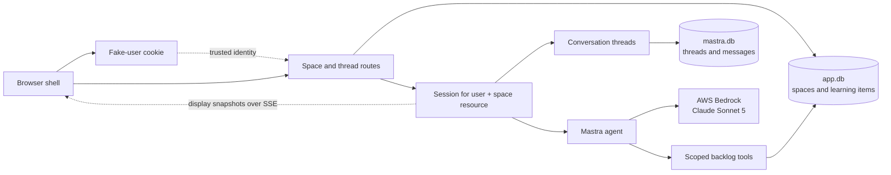
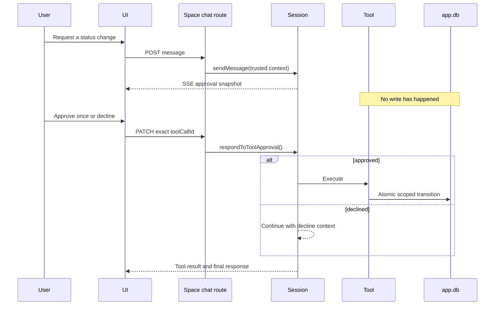

# Mastra AgentController learning app

A local Next.js application for learning how Mastra `AgentController` connects
a browser UI to persistent, tool-using agent sessions.

The application has a four-level ownership model:

```text
fake user
└── learning space
    └── Mastra resource and Session
        └── conversation threads
```

Each learning space begins with an independent copy of the tracked Mastra
curriculum. Conversations inside one space share that space's backlog, but
their transcripts remain separate. Other users and spaces have different
backlogs, resources, Sessions, threads, runs, and approvals.

The name prompt is development-only fake authentication, not proof of identity.
Use this app only on a local or otherwise trusted machine.

## Run locally

Prerequisites:

- [nvm](https://github.com/nvm-sh/nvm)
- an AWS CLI profile named `dev`
- Bedrock access to the Claude Sonnet 5 inference profile

Install and start:

```sh
nvm use
npm install
AWS_PROFILE=dev AWS_REGION=us-east-1 npm run dev
```

Then open [http://localhost:3000](http://localhost:3000).

The default model is `us.anthropic.claude-sonnet-5`. Override it when needed:

```sh
BEDROCK_MODEL_ID=global.anthropic.claude-sonnet-5
```

## Architecture



The application runs one shared `AgentController` in the Next.js process.
[`src/mastra/runtime.ts`](src/mastra/runtime.ts) caches one live `Session` per
derived learning-space resource. A Session owns the active thread, run,
approval, suspension, display state, and event subscription for that space.

The resource hierarchy is enforced server-side:

1. the HTTP-only cookie selects the normalized fake user;
2. a space route verifies `(ownerId, spaceId)` in the application database;
3. the server derives stable owner, resource, and Session IDs from that trusted
   user and space;
4. thread switching verifies the persisted thread's `resourceId`; and
5. backlog tools receive server-created `RequestContext` containing only the
   validated user and space IDs.

Client-supplied owner, resource, Session, or database identity is never trusted.

## HTTP and SSE surface

| Route | Purpose |
| --- | --- |
| `GET /api/session` | Read the fake-user session. |
| `POST /api/session` | Normalize a name and create the HTTP-only cookie. |
| `DELETE /api/session` | Clear the fake-user cookie. |
| `GET /api/spaces` | List spaces, provisioning the default space atomically when needed. |
| `POST /api/spaces` | Create a space and seed its independent curriculum copy. |
| `GET /api/spaces/:spaceId/chat` | Stream complete `ChatState` snapshots over SSE. |
| `POST /api/spaces/:spaceId/chat` | Send a message through the selected Session. |
| `PATCH /api/spaces/:spaceId/chat` | Approve or decline the exact pending tool call. |
| `GET /api/spaces/:spaceId/threads` | List resource-scoped conversation summaries. |
| `POST /api/spaces/:spaceId/threads` | Create and activate a conversation while idle. |
| `PUT /api/spaces/:spaceId/threads/:threadId/active` | Verify ownership and switch the active thread while idle. |

The selected space is stored in the tab URL as `?space=...`. Switching a
conversation keeps the space's EventSource connected; the Session emits the
thread lifecycle event and the server replaces the transcript projection with
the selected thread's persisted messages. Switching spaces remounts the
space-scoped stream.

Thread summaries expose only an ID, a bounded first-user-message preview,
timestamps, and active state. Preview messages are loaded in one batch, and
threads are ordered by most recent activity with a deterministic tie-breaker.
Forked subagent threads are excluded.

Creation and switching return `409 Conflict` while the selected Session has a
run, stream, approval, or suspension that makes rebinding unsafe. The UI locks
space and conversation controls too, but the route check is authoritative for
stale tabs and direct requests.

## Agent, tools, and approval

[`src/mastra/agent.ts`](src/mastra/agent.ts) defines the assistant and Bedrock
model. [`src/mastra/tools/learning-backlog.ts`](src/mastra/tools/learning-backlog.ts)
defines four narrow tools:

| Tool | Policy | Behavior |
| --- | --- | --- |
| `list_learning_items` | allow | List summaries, optionally by status. |
| `get_learning_item` | allow | Read one item by exact ID. |
| `mark_learning_item_started` | ask | Move only `not-started → in-progress`. |
| `mark_learning_item_complete` | ask | Move an incomplete item to `completed`. |

The mode exposes only those tools. Built-in planning, task, user-question, and
subagent tools are disabled. The contained workspace under `.data/workspace`
is read-only and no workspace tools are exposed.

An edit pauses the same model run until the exact tool-call ID is approved or
declined:



Status transitions are monotonic and idempotent. Repeating a completed action
returns `changed: false`; it cannot regress a completed item.

## Persistence boundaries

The tracked file `data/learning-backlog.seed.json` is a template. Creating a
space copies and validates that curriculum inside one transaction; later seed
changes do not rewrite existing spaces.

Runtime data is divided intentionally:

```text
.data/
├── app.db                 # users' spaces and space-scoped learning items
├── mastra.db              # resources, threads, messages, and Mastra storage
├── workspace/             # contained read-only workspace root
└── learning-backlog.json  # legacy artifact; no longer read, written, or migrated
```

| State | Storage | Browser refresh | Server restart |
| --- | --- | --- | --- |
| Selected fake user | HTTP-only cookie | Preserved | Preserved |
| Selected space | URL | Preserved | Preserved |
| Spaces and learning-item status | `.data/app.db` | Preserved | Preserved |
| Threads and completed messages | `.data/mastra.db` | Preserved | Preserved |
| Active Session object and SSE connection | Node.js process | Reconnected/reused | Recreated |
| Active thread | Session; latest updated thread on recreation | Preserved in-process | Latest persisted thread selected |
| Streaming text and current tool panel | Session display state | Usually preserved | Lost |
| Pending approval and active model run | Node.js process | Preserved in-process | Lost |

On browser reconnection, the server sends a fresh snapshot instead of replaying
event IDs. A process restart recreates each Session against the same stable
resource and selects that resource's latest updated persisted thread.

Tabs using different spaces have independent Sessions and active threads. Tabs
using the same user and space intentionally share one live Session, so a thread
switch or run in one such tab appears in the other.

## Local reset choices

Stop the development server before deleting or editing databases.

Reset learning-item statuses in every existing space to the current tracked
seed while preserving spaces and conversations:

```sh
sqlite3 .data/app.db "
UPDATE app_learning_items
SET status = CASE item_id
  WHEN 'agent-controller-lifecycle' THEN 'completed'
  WHEN 'memory-and-persistence' THEN 'completed'
  ELSE 'not-started'
END;
"
```

Reset application-owned data (spaces and their backlog copies), while leaving
Mastra conversations on disk:

```sh
rm -f .data/app.db .data/app.db-shm .data/app.db-wal
```

Reset Mastra threads and messages, while preserving spaces and backlogs:

```sh
rm -f .data/mastra.db .data/mastra.db-shm .data/mastra.db-wal
```

Reset all current application state:

```sh
rm -f \
  .data/app.db .data/app.db-shm .data/app.db-wal \
  .data/mastra.db .data/mastra.db-shm .data/mastra.db-wal
```

The legacy `.data/learning-backlog.json` is deliberately omitted from these
commands. This feature neither migrates nor deletes it.

## Verification

```sh
npm run typecheck
npm run lint
npm test
npm run build
AWS_PROFILE=dev AWS_REGION=us-east-1 npm run bedrock:smoke
AWS_PROFILE=dev AWS_REGION=us-east-1 npm run controller:smoke
AWS_PROFILE=dev AWS_REGION=us-east-1 npm run agent-tools:smoke
AWS_PROFILE=dev AWS_REGION=us-east-1 npm run agent-approval:smoke
npm run persistence:smoke
```

The checks cover:

1. application schema, transactional provisioning, normalized uniqueness,
   status transitions, and user/space isolation;
2. trusted request identity and resource derivation;
3. conversation preview batching, ordering, active state, and ownership;
4. direct Bedrock and AgentController generation;
5. agent-selected reads and approval-gated, idempotent edits;
6. isolation of approval state between spaces; and
7. restart restoration of a resource's multiple threads and active transcript.

## Current limitations

- Fake authentication allows name impersonation and is unsuitable for
  deployment.
- The controller and Session cache are process-local; there is no coordination
  across replicas or machines.
- Active model runs and approvals are not durable across server failure.
- SSE has no event replay.
- Concurrent navigation is intentionally rejected while a Session is busy.
- Space and thread rename/delete, sharing, invitations, cloning, and branching
  are not implemented.
- Existing spaces do not receive later curriculum-template changes.
- Tool activity is operational display state, not a durable audit log.
- Memory sends the most recent 20 messages to the model even though the UI can
  display the full persisted transcript.

The planned multi-process direction is described in
[the durable-agent and Kubernetes plan](docs/plans/2026-07-20-092510-mastra-durable-agent-kubernetes-ha-plan.md).

`AgentController` is beta. The installed TypeScript types and embedded package
documentation are the source of truth, and dependencies are pinned exactly in
`package.json` and `package-lock.json`.

## Plans and decisions

- [Initial AgentController/Next.js plan](docs/plans/2026-07-10-102257-mastra-agent-controller-nextjs-plan.md)
- [Learning-backlog agent plan](docs/plans/2026-07-15-130130-basic-learning-backlog-agent-plan.md)
- [Durable-agent and Kubernetes plan](docs/plans/2026-07-20-092510-mastra-durable-agent-kubernetes-ha-plan.md)
- [Fake-auth chat-isolation plan](docs/plans/2026-07-22-114821-basic-fake-auth-chat-isolation-plan.md)
- [Learning-spaces umbrella plan](docs/plans/2026-07-22-191728-learning-spaces-isolated-backlogs-plan.md)
- [Phase 1: application database](docs/plans/2026-07-23-161759-learning-spaces-phase-1-app-database-plan.md)
- [Phase 2: default-space isolation](docs/plans/2026-07-23-161800-learning-spaces-phase-2-default-space-isolation-plan.md)
- [Phase 3: multiple spaces](docs/plans/2026-07-23-161801-learning-spaces-phase-3-multiple-spaces-plan.md)
- [Phase 4: conversation navigation](docs/plans/2026-07-23-161802-learning-spaces-phase-4-conversation-navigation-plan.md)
