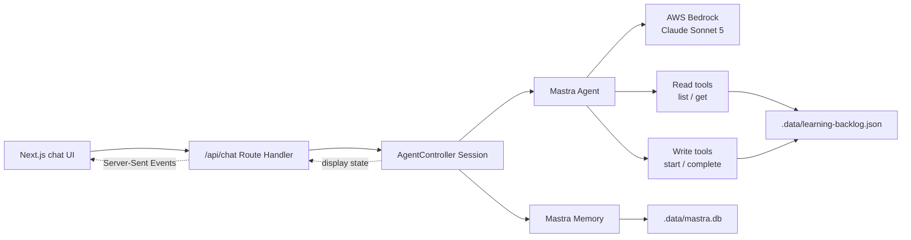
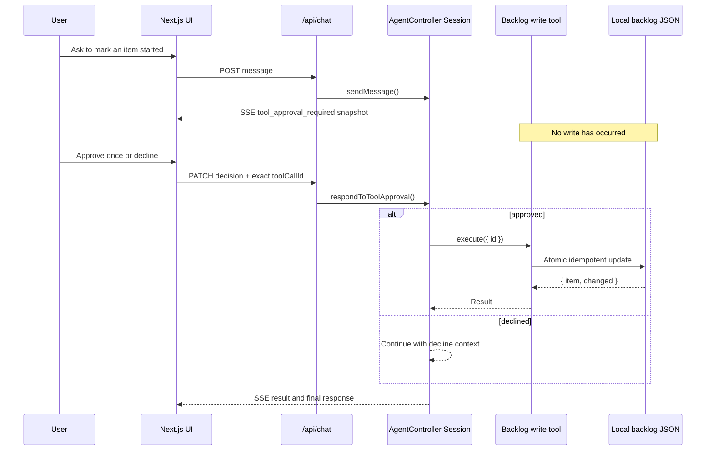
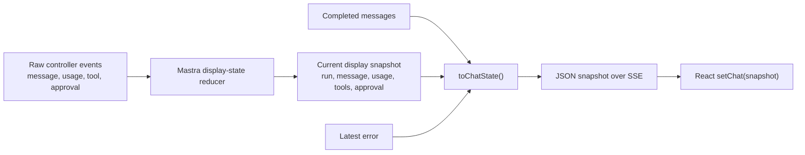

# Mastra AgentController learning app

A local-only Next.js application for learning how Mastra's `AgentController` connects a browser UI to a persistent, tool-using agent session.

The model is Claude Sonnet 5 through Amazon Bedrock. AWS authentication uses the standard SDK credential chain and the `dev` profile; no AWS credentials are stored in this project.

## Run locally

Prerequisites:

- [nvm](https://github.com/nvm-sh/nvm)
- An AWS CLI profile named `dev`
- Bedrock access to the Claude Sonnet 5 US inference profile

Install and start the app:

```sh
nvm use
npm install
AWS_PROFILE=dev AWS_REGION=us-east-1 npm run dev
```

Open [http://localhost:3000](http://localhost:3000).

Optional configuration:

```sh
BEDROCK_MODEL_ID=global.anthropic.claude-sonnet-5
```

The default is `us.anthropic.claude-sonnet-5`.

## Architecture



The application runs in one Next.js process:

- `POST /api/chat` sends a user message and starts an agent run.
- `PATCH /api/chat` approves or declines the exact pending tool call.
- `GET /api/chat` opens a Server-Sent Events stream of complete UI snapshots.
- `DELETE /api/chat` creates and selects a new conversation thread.

The route subscribes to the session and renders from `display_state_changed` snapshots, with high-level `message_end` events maintaining the persisted transcript projection.

## Why this is now an agent

Conversation memory alone made the original app a stateful chatbot: the model could use previous user and assistant messages, but it could not observe or change anything outside that conversation.

The learning-backlog tools add a small agent loop:

```text
user supplies a goal
→ model decides whether it needs a tool
→ tool observes or changes local backlog state
→ tool result returns to the model
→ model chooses another tool or produces a final response
```

For example, “review my backlog and recommend what to learn next” does not contain the backlog itself. The model can choose `list_learning_items`, inspect one item with `get_learning_item`, and base its answer on those observations. When asked to change status, it can propose a constrained action, wait for approval, observe the real result, and then explain what happened.

This agent is still reactive: a user message starts every run. It has no background loop, scheduler, internet access, general filesystem access, shell, or subagents.

## Mastra concepts in this app

### Agent and tools

[`src/mastra/agent.ts`](src/mastra/agent.ts) defines the assistant's instructions, Bedrock model, and custom tools. [`src/mastra/tools/learning-backlog.ts`](src/mastra/tools/learning-backlog.ts) defines four narrow, typed Mastra tools:

| Tool | Category | Policy | Behavior |
| --- | --- | --- | --- |
| `list_learning_items` | `read` | `allow` | Lists validated item summaries, optionally by status. |
| `get_learning_item` | `read` | `allow` | Gets one validated item by exact ID. |
| `mark_learning_item_started` | `edit` | `ask` | Moves only `not-started → in-progress`; otherwise returns `changed: false`. |
| `mark_learning_item_complete` | `edit` | `ask` | Moves an incomplete item to `completed`; repeating it returns `changed: false`. |

Read tools explicitly use `requireApproval: () => false`, so harmless observations can stay within one uninterrupted model run. Both edit tools use `requireApproval: true`. Their store operations are idempotent and cannot regress a completed item.

### AgentController

[`src/mastra/runtime.ts`](src/mastra/runtime.ts) creates the `AgentController`. The controller hosts shared infrastructure: the agent, storage, memory, modes, workspace, and tool permissions.

The app deliberately has one mode, `chat`, which exposes exactly the four backlog tools. Built-in planning, task, user-question, and subagent tools are disabled. This keeps the learning surface bounded while still showing observation, action, and human approval.

### Session

The controller creates one session for the local user. The session owns live per-conversation state:

- Active thread
- Current mode and model
- Run status and event subscriptions
- Coalesced display-state snapshot
- Tool permission categories
- A pending tool approval, when the run is paused

The browser never receives the session object. The Route Handler translates it into the small JSON shape in [`src/lib/chat-types.ts`](src/lib/chat-types.ts).

### Thread, Memory, and Storage

These layers have different jobs:

- A thread identifies one conversation.
- `Memory` saves and recalls the thread's messages for the agent.
- `LibSQLStore` persists those records to `.data/mastra.db`.
- The backlog store persists application state separately in `.data/learning-backlog.json`.

Configuring storage alone creates persistent controller infrastructure, but persistent message history also requires the explicit `Memory` instance. Conversation history and backlog state are intentionally separate: resetting one does not have to reset the other.

### Workspace

The current beta API requires each session to have a valid `Workspace`. This app supplies a contained, read-only local filesystem under `.data/workspace`, but exposes no workspace tools to the model.

## Tool loop, permissions, and approval

The mode allowlist controls which tools exist in this chat. The category resolver maps list/get to `read` and start/complete to `edit`; session policy then resolves `read: allow` and `edit: ask`.

An approved mutation crosses this boundary:



The PATCH route accepts only `approve` or `decline` for the exact tool-call ID currently armed in both the visible state and controller. Stale, mismatched, or duplicate decisions receive `409 Conflict`. The UI disables message, new-conversation, and decision controls while the gate is being resolved.

Approval authorizes one proposed call, not all future writes. A decline executes no mutation. If the server stops while approval is pending, the write has not happened and the interrupted model run is not resumed automatically.

## Events and SSE

Mastra emits detailed events as an agent run progresses. The web bridge uses coalesced display state instead of interpreting raw token and tool events in React.



The route listens to a small set of high-level events:

- `message_end` adds a completed message to transcript history.
- Thread events clear the old transcript when the active conversation changes.
- `error` retains a client-friendly error message.
- `display_state_changed` triggers transmission of the latest UI snapshot.

This keeps React from reconstructing Mastra's event state machine. Each browser update has one consistent shape, so reconnecting or missing an intermediate event is easier to recover from. SSE is one-way from server to browser: browser commands use HTTP methods, while controller state streams back over one long-lived `GET` request.

## Refresh and persistence model

A browser refresh discards React state and opens a new SSE connection. `GET /api/chat` asks the still-running server session for persisted messages and its current display state, then sends one initial `ChatState` snapshot.

The server runtime is memoized on `globalThis` in [`src/mastra/runtime.ts`](src/mastra/runtime.ts). This prevents Next.js development reloads from casually creating competing controllers and database connections, but it is only a process-local cache.

A server restart is the stronger persistence test. It destroys the controller, session, subscriptions, display state, pending approval, and active model run. On startup, the app creates a new controller and session with the same fixed resource ID, opens the same LibSQL database, and resumes its persisted thread and messages. The backlog is independently recovered from its JSON file.

| State | Storage location | Browser refresh | Server restart |
| --- | --- | --- | --- |
| Textarea contents | React | Lost | Lost |
| SSE connection | Browser and server | Reconnected | Reconnected |
| Active `Session` object | Node.js process | Preserved | Recreated |
| Threads and completed messages | LibSQL | Preserved | Preserved |
| Learning-item statuses | Backlog JSON | Preserved | Preserved |
| Streaming assistant text | Session display state | Usually preserved | Lost |
| Current/latest visible tool activity | Session display state | Preserved while process lives | Lost |
| Pending approval and active model run | Node.js process | Preserved while process lives | Lost |

Visible tool activity is deliberately operational state, not a durable audit trail. The saved transcript may describe an earlier tool result after restart, but the activity panel itself is reconstructed only from the live session's current/latest display state.

### Persistence limitations

- The session, owner, and resource IDs are fixed. Every local browser tab shares one session and active thread.
- “New conversation” creates another persisted thread, but the UI has no thread list for returning to older conversations.
- SSE events have no IDs or `Last-Event-ID` replay. Reconnection sends a fresh snapshot instead of replaying missed events.
- A browser disconnect does not stop the Node.js model run, but a server crash does. A partial response or pending approval is not resumed.
- The `globalThis` singleton does not coordinate multiple Node.js processes, serverless instances, or machines.
- Local data files are not shared across hosts.
- The UI can display the complete saved transcript, while `Memory` currently supplies only the latest 20 messages to the model.
- Concurrent sends are rejected while a run is active; there is no multi-tab queue or broader concurrency design.

## Planned durable-agent and Kubernetes direction

The next architecture step is documented in the [Mastra durable agent and Kubernetes high-availability plan](docs/plans/2026-07-20-092510-mastra-durable-agent-kubernetes-ha-plan.md). It proposes Mastra's `createEventedAgent()`, Redis Streams, shared PostgreSQL state, explicit run identity, and run-aware SSE so multiple load-balanced pods can accept requests and observe the same background run without sticky sessions.

The intended gains are request-independent execution, reconnectable event streams, replica-safe conversation and backlog state, and continued application availability when an API or observer pod is replaced. The selected evented execution remains best effort: if the pod actively running Bedrock and the tool loop is killed, another pod can preserve and report the emitted state but does not automatically continue that run. An externally orchestrated variant such as `createInngestAgent()` would be the follow-on for executor-independent recovery.

This section describes planned work. The architecture and persistence matrix above remain the source of truth for the currently implemented local application.

## Useful commands

```sh
npm run typecheck
npm run lint
npm run build
AWS_PROFILE=dev AWS_REGION=us-east-1 npm run bedrock:smoke
AWS_PROFILE=dev AWS_REGION=us-east-1 npm run controller:smoke
AWS_PROFILE=dev AWS_REGION=us-east-1 npm run agent-tools:smoke
AWS_PROFILE=dev AWS_REGION=us-east-1 npm run agent-approval:smoke
npm run persistence:smoke
```

The smoke scripts make the learning checkpoints explicit:

1. `bedrock:smoke` proves AWS and model access without Mastra.
2. `controller:smoke` proves the AgentController event and generation path.
3. `agent-tools:smoke` proves agent-selected read tools and a no-tool conversational path.
4. `agent-approval:smoke` proves decline, approved start and completion, idempotency, completed-item protection, and automatic restoration of the original backlog.
5. `persistence:smoke` starts a fresh runtime and proves saved messages can be restored.

## Local data and reset

The tracked seed is `data/learning-backlog.seed.json`. On first access, the backlog store copies and validates it into the ignored runtime area:

```text
.data/
├── learning-backlog.json  # mutable learning-item status
├── mastra.db              # threads, messages, controller storage
└── workspace/             # contained read-only workspace root
```

To restore all learning items to their original seed statuses without deleting chat history, wait until the agent is idle and run:

```sh
rm .data/learning-backlog.json
```

The next backlog tool call recreates the runtime file from the seed. Starting a new conversation afterward avoids a transcript that describes statuses from before the reset.

To fully reset the app, stop the development server and run:

```sh
rm -rf .data
```

This deletes both backlog state and conversation history. These are intentionally manual local-development workflows; the agent has no reset, arbitrary status, filesystem, or shell tool.

## Current scope

Implemented:

- Local Next.js chat with Bedrock Claude Sonnet 5
- One AgentController, session, mode, and reactive agent
- Persisted conversation threads and memory
- Agent-selected list/get observation tools
- Approval-gated started/completed actions
- Visible tool inputs, results, errors, and pending approval
- Local seed/runtime backlog with atomic idempotent writes

Intentionally deferred:

- Authentication, multiple users, or per-user backlogs
- Arbitrary create, edit, delete, reorder, or status-reset tools
- Multiple modes and model selection
- Background jobs, schedules, proactive notifications, and external APIs
- General filesystem, shell, workspace, planning, task, and subagent tools
- A thread picker or durable historical tool-activity viewer
- File uploads and Markdown plugins
- RAG and vector databases
- Deployment and production hardening

`AgentController` is beta. Its installed TypeScript types and embedded package documentation are treated as the source of truth, and dependency versions are pinned exactly in `package.json` and `package-lock.json`.

Plans and decision records:

- [`docs/plans/2026-07-10-102257-mastra-agent-controller-nextjs-plan.md`](docs/plans/2026-07-10-102257-mastra-agent-controller-nextjs-plan.md)
- [`docs/plans/2026-07-15-130130-basic-learning-backlog-agent-plan.md`](docs/plans/2026-07-15-130130-basic-learning-backlog-agent-plan.md)
- [`docs/plans/2026-07-20-092510-mastra-durable-agent-kubernetes-ha-plan.md`](docs/plans/2026-07-20-092510-mastra-durable-agent-kubernetes-ha-plan.md)
