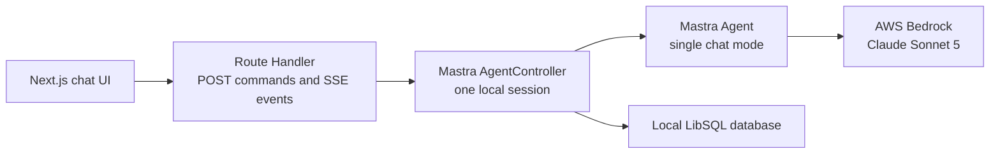

# Mastra AgentController Next.js learning app

Status: Implemented

Created: 2026-07-10 10:22:57 America/New_York

## Outcome

Build a simple, local-only Next.js chat application to learn Mastra's `Agent`, `AgentController`, `Session`, thread persistence, and event model. The backend model will be Claude Sonnet 5 through Amazon Bedrock, authenticated with `AWS_PROFILE=dev`.

## Guiding principles

- Optimize for learning and readability rather than production flexibility.
- Run the UI and Mastra in one Next.js process.
- Introduce one concept at a time and verify it before adding the next layer.
- Keep credentials and all AWS access on the server.
- Pin dependency versions because `AgentController` is currently beta.
- Defer features that do not teach the basic controller lifecycle.

## Architecture



Use direct Next.js integration rather than a separate Mastra server. This keeps the application to one process and makes the boundary between the browser, controller, agent, and model visible without adding deployment-oriented infrastructure.

## Implementation plan

### 1. Scaffold the application

- Create a Next.js App Router project using TypeScript, ESLint, and the `src/` layout.
- Target Node.js 22.
- Use plain CSS or CSS Modules with no UI component library or Tailwind dependency.
- Add local environment and database files to `.gitignore`.
- Install and pin the required Next.js, Mastra, LibSQL, AI SDK Bedrock, and AWS credential-provider dependencies.

### 2. Prove Bedrock access independently

Before introducing the controller or UI, make one small server-side model call. Run the application with:

```sh
AWS_PROFILE=dev AWS_REGION=us-east-1 npm run dev
```

- Create the Bedrock provider with `createAmazonBedrock()`.
- Use `fromNodeProviderChain()` so the AWS SDK credential chain honors `AWS_PROFILE=dev`.
- Start with the US cross-region model ID `us.anthropic.claude-sonnet-5`.
- If that inference profile is unavailable to the account, verify and select the appropriate documented in-region or global model ID.
- Return clear configuration errors without exposing credential details.

This checkpoint separates IAM, region, and model-access failures from Mastra integration failures.

### 3. Introduce Mastra core concepts

- Define one readable `Agent` with a short system instruction.
- Configure one `AgentController` with a single mode named `chat`.
- Use fixed local session, owner, and resource identifiers.
- Back threads with a `LibSQLStore` stored under `.data/`.
- Lazily initialize and cache server-side runtime objects so development reloads do not intentionally create competing controllers.
- Send a message without the web UI and inspect the session, thread, and display-state behavior.

Learning order:

1. Agent
2. AgentController
3. Session
4. Thread
5. Events and display state

Because `AgentController` is beta, use the installed package's TypeScript types as the final authority when documentation examples and the current API differ.

### 4. Add a minimal browser bridge

Create one Next.js Route Handler with two methods:

- `POST /api/chat` submits a message.
- `GET /api/chat` maintains a Server-Sent Events connection.

The event connection should:

- Send the current display-state snapshot immediately.
- Subscribe to `display_state_changed`.
- Send updated snapshots while the model response streams.
- Surface controller errors in a safe, client-friendly form.
- Unsubscribe when the browser disconnects.

Render from Mastra's coalesced display state instead of rebuilding UI state from every low-level token and tool event.

### 5. Build the chat interface

The initial interface contains only:

- Conversation transcript
- Textarea and Send button
- Streaming assistant response
- Running or idle indicator
- Clear error state
- Automatic scrolling

Keep the UI code small enough that the controller lifecycle remains the focus.

### 6. Add persistence and recovery

- Restore the active thread when the page or development server restarts.
- Confirm that multi-turn context survives a browser refresh.
- Reconnect the SSE stream and resend the current snapshot after disconnection.
- Add a simple new-conversation action only after the basic persisted flow works.

### 7. Document and verify

Document:

- How `Agent`, `AgentController`, `Session`, and `Thread` relate
- The application architecture and request/event flow
- Required AWS configuration and model access
- The exact local run command
- The local conversation database location
- Known beta limitations

Verification checklist:

- `npm run lint`
- `npm run build`
- Authentication succeeds through `AWS_PROFILE=dev`
- Claude Sonnet 5 produces a streamed response
- Multi-turn context works
- The transcript returns after browser and server restarts
- Missing AWS credentials or model access produces a useful error
- No credentials appear in client bundles, logs, or tracked files

## Delivery checkpoints

1. Next.js scaffold and successful Bedrock smoke test
2. AgentController session, events, and local persistence without UI polish
3. Chat UI, reconnect behavior, documentation, and final verification

## Deferred work

- Authentication and multiple users
- Deployment and production hardening
- Model and mode selectors
- Agent tools and approval flows
- Subagents
- Markdown rendering plugins
- File uploads
- RAG and vector databases
- External services unrelated to Bedrock

## Implementation notes

- The project uses Node.js 24.16.0, recorded in `.nvmrc`, rather than Node.js 22 because Node 24 was already installed and satisfies the current Mastra and Next.js requirements.
- The installed AgentController beta API uses explicit sessions: the host calls `createSession()`, and commands and subscriptions are driven through the returned `Session`.
- A valid `Workspace` is required by the current session implementation even when the agent has no tools. The app supplies a contained, read-only local filesystem and exposes no workspace tools.
- `LibSQLStore` persists controller infrastructure, while an explicit `Memory` instance is required to persist and recall conversation messages.
- Browser verification caught a replay edge case where an idle session's stale `currentMessage` could duplicate the last persisted message. The client projection includes `currentMessage` only while a run is active.
- The Bedrock, controller, SSE streaming, refresh persistence, and new-conversation flows were verified against the `dev` AWS profile.

## References

- [Mastra AgentController overview](https://mastra.ai/docs/agent-controller/overview)
- [Mastra Session and display state](https://mastra.ai/docs/agent-controller/session)
- [Mastra AgentController reference](https://mastra.ai/reference/agent-controller/agent-controller-class)
- [AI SDK Amazon Bedrock provider](https://ai-sdk.dev/providers/ai-sdk-providers/amazon-bedrock)
- [AWS Claude Sonnet 5 model card](https://docs.aws.amazon.com/bedrock/latest/userguide/model-card-anthropic-claude-sonnet-5.html)
- [Next.js App Router documentation](https://nextjs.org/docs/app/getting-started)
