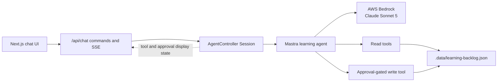

# Basic learning-backlog agent

Status: Complete — Phases 1–4 implemented and verified

Created: 2026-07-15 13:01:30 America/New_York

## Outcome

Evolve the existing local Mastra AgentController chatbot into a small but meaningfully agentic learning application. The agent can inspect a local learning backlog, decide which observations it needs, recommend a next topic, and—only after explicit user approval—mark an item started or complete.

The result should make this loop visible and understandable:

```text
user goal
→ model chooses a tool
→ tool observes or changes local state
→ result returns to the model
→ model decides whether to use another tool or answer
```

This is still a personal, local-only learning project. The goal is to expose the smallest useful agent loop and approval flow, not to build a general task manager.

## Relationship to the original plan

This plan extends [`2026-07-10-102257-mastra-agent-controller-nextjs-plan.md`](./2026-07-10-102257-mastra-agent-controller-nextjs-plan.md).

The original plan intentionally deferred tools and approval flows while establishing:

- Bedrock model access
- AgentController sessions and threads
- persisted conversation memory
- Server-Sent Events
- a minimal React chat interface

Those foundations remain in place. This plan adds capabilities without introducing another server, another model, authentication, external APIs, or a second agent.

This plan is complete and remains the decision record for the local tool loop and approval behavior. The follow-on [Mastra durable agent and Kubernetes high-availability plan](./2026-07-20-092510-mastra-durable-agent-kubernetes-ha-plan.md) preserves those capabilities while replacing the single-process session, local persistence, and process-bound approval assumptions for a multi-pod deployment. Items listed as deferred below are deferred from this learning slice; the follow-on plan explicitly takes up distributed execution, shared mutable backlog state, and load-balanced approval routing.

## Why this qualifies as a basic agent

The current application uses Mastra's `Agent` class, but its behavior is equivalent to a stateful chatbot: the model receives user input and message history, then produces a response. Its configured tool surface is empty.

After this change, the model will be able to:

1. Receive a goal rather than only a factual question.
2. Observe state that was not included in the user's message.
3. Choose which tools to invoke and with what arguments.
4. Incorporate tool results into a subsequent model step.
5. Take a constrained action after receiving human approval.
6. Stop by returning a final response when it has enough information.

The agent remains user-triggered. Background execution is not required for goal-directed, tool-using behavior and is outside this plan.

## Guiding principles

- Keep the data local, small, deterministic, and easy to inspect manually.
- Teach one concept at a time: read tools first, visible tool events second, approved writes third.
- Use custom Mastra tools rather than exposing general filesystem access.
- Make tool names, inputs, results, and approval state visible in the UI.
- Allow read operations automatically; require an explicit decision for mutations.
- Preserve the existing chat, persistence, SSE, and new-conversation behavior.
- Treat the installed `@mastra/core@1.50.1` TypeScript types and runtime behavior as authoritative.
- Avoid abstractions that would only be useful for multiple users, deployments, or additional domains.

## Proposed user experience

The seed backlog will contain a handful of Mastra learning topics with stable IDs, descriptions, difficulty, prerequisites, and status.

Example prompt:

> Review my learning backlog and recommend the best topic to study next. Inspect any item you need before deciding.

Expected read-only behavior:

```text
User asks for a recommendation
→ agent calls list_learning_items
→ agent reviews returned summaries
→ agent optionally calls get_learning_item
→ agent explains its recommendation
```

Example action prompt:

> Mark the tools topic complete, then tell me what I should study next.

Expected approval behavior:

```text
Agent calls mark_learning_item_complete
→ AgentController pauses at the approval gate
→ UI shows the tool name and arguments
→ user approves or declines
→ approved tool updates the local file, or declined tool makes no change
→ agent observes the outcome and responds
```

The interface should display a compact activity card for each tool call. Raw JSON is acceptable here because inspecting the mechanics is part of the learning goal.

## Architecture



The browser continues to communicate only with the Next.js Route Handler. Tools and filesystem access remain server-side.

## Data model and local storage

Add a tracked seed file at `data/learning-backlog.seed.json`. Each item will use a deliberately small schema:

```ts
interface LearningItem {
  id: string;
  topic: string;
  description: string;
  difficulty: 1 | 2 | 3;
  prerequisites: string[];
  status: "not-started" | "in-progress" | "completed";
}
```

Suggested seed topics:

- AgentController lifecycle
- Agent tools
- Tool approval
- Memory and persistence
- Workflows versus agents

Runtime state belongs in `.data/learning-backlog.json`, alongside the existing ignored local database. On first access, a small store module will initialize the runtime file from the tracked seed.

This separation provides:

- a reproducible starting point in Git
- writable personal state that does not dirty the worktree
- a clear external-state boundary for the agent
- an easy reset path by deleting the runtime file

Use Zod to validate the seed and runtime file before returning data to a tool. Unknown IDs and invalid data should produce explicit errors rather than fabricated results.

For the single write operation, replace the complete JSON document through a temporary file and rename it. This remains simple while avoiding a partially written backlog if the process is interrupted during the write.

## Tool design

Define stable exported tool-name constants so the agent tool map, mode allowlist, permission resolver, event projection, tests, and UI labels cannot silently drift.

### `list_learning_items`

Purpose: Observe the current backlog and provide enough information to choose likely candidates.

Input:

```ts
{
  status?: "not-started" | "in-progress" | "completed";
}
```

Output:

```ts
{
  items: Array<{
    id: string;
    topic: string;
    difficulty: 1 | 2 | 3;
    prerequisites: string[];
    status: "not-started" | "in-progress" | "completed";
  }>;
}
```

The optional filter gives the model a small but real argument choice without adding search syntax.

### `get_learning_item`

Purpose: Inspect one item's complete details before recommending or acting on it.

Input:

```ts
{ id: string }
```

Output:

```ts
{ item: LearningItem }
```

An unknown ID returns a tool error with a useful message.

### `mark_learning_item_started`

Purpose: Perform the smallest useful transition before completion.

Input:

```ts
{ id: string }
```

Output:

```ts
{
  item: LearningItem;
  changed: boolean;
}
```

Calling it for a not-started item changes its status to `in-progress`. Calling it for an in-progress or completed item succeeds with `changed: false`; it never regresses a completed item.

### `mark_learning_item_complete`

Purpose: Perform the plan's one state-changing action.

Input:

```ts
{ id: string }
```

Output:

```ts
{
  item: LearningItem;
  changed: boolean;
}
```

Calling it for an already completed item succeeds with `changed: false`, making retries idempotent. An unknown ID fails without modifying the file.

## Tool visibility and permissions

Attach the four custom tools to the existing agent. Set the `chat` mode's `availableTools` to exactly their four exposed names. Continue disabling all built-in controller tools and continue exposing no Workspace tools.

Configure `toolCategoryResolver` as follows:

| Tool | Category | Policy |
| --- | --- | --- |
| `list_learning_items` | `read` | `allow` |
| `get_learning_item` | `read` | `allow` |
| `mark_learning_item_started` | `edit` | `ask` |
| `mark_learning_item_complete` | `edit` | `ask` |

Initialize the session's category policies with `session.permissions.setForCategory()` after session creation. Per-tool rules are unnecessary for this first example.

Both write tools should also declare `requireApproval: true` in their `createTool()` definitions so their mutating intent is visible where each capability is defined. AgentController remains responsible for presenting and resolving the approval through its permission system.

Do not expose an “always allow” option in the first UI. Only one-time approve and decline decisions are needed to understand the lifecycle.

## Agent instructions and stopping behavior

Replace the current “You have no tools” instruction with rules that make the intended loop explicit:

- Use backlog tools whenever an answer depends on current backlog state.
- Do not invent item IDs, status, prerequisites, or tool results.
- Prefer `list_learning_items` before retrieving details unless the user supplied an exact known ID.
- Retrieve details only when they affect the answer.
- Use a mutation tool only when the user explicitly requests that state change.
- After a mutation succeeds or is declined, explain the outcome and stop unless the original request still requires another observation.
- Do not repeatedly call a tool with unchanged arguments unless the previous result requires verification.

The installed AgentController currently supplies its own `maxSteps` value (`1000`) to controller-driven runs, overriding a smaller `Agent.defaultOptions.maxSteps`. Therefore this plan will not claim that setting `maxSteps: 5` on the agent creates an effective controller loop bound.

For this learning slice, practical boundedness comes from four narrow tools, deterministic results, idempotent mutation, and explicit instructions. Do not patch `node_modules` or add a custom run engine merely to lower the controller's internal limit. Revisit this only if the pinned AgentController exposes a supported host-level stop configuration or observed behavior shows repeated calls.

## Browser state projection

Extend `ChatState` with two serializable concepts:

```ts
interface ChatToolActivity {
  toolCallId: string;
  name: string;
  args: unknown;
  status: "streaming_input" | "running" | "completed" | "error";
  result?: unknown;
  isError?: boolean;
}

interface PendingToolApproval {
  toolCallId: string;
  toolName: string;
  args: unknown;
}
```

`toChatState()` will convert `displayState.activeTools` from a `Map` to an array and copy `displayState.pendingApproval` into plain JSON. This keeps React dependent on the coalesced AgentController display state rather than reconstructing tool lifecycles from raw events.

The initial tool activity view is intentionally scoped to the current or most recent run in the live server session. Completed tool calls are also stored inside Mastra message content, but rebuilding a durable, historical tool transcript is not required for the first lesson. Document that tool activity may disappear after a server restart even though completed text messages persist.

## Approval command bridge

Add `PATCH /api/chat` with this request shape:

```ts
{
  toolCallId: string;
  decision: "approve" | "decline";
}
```

The handler will:

1. Validate the request body.
2. Read `session.displayState.get().pendingApproval`.
3. Reject the request if no approval is pending or the ID does not match.
4. Call `session.respondToToolApproval()` with the matching ID and decision.
5. Return `204` immediately; subsequent tool and agent progress arrives over SSE.

Use `respondToToolApproval()` rather than calling the lower-level continuation methods directly. It releases the approval gate that the active stream processor is awaiting.

While approval is pending, the original `POST /api/chat` remains in progress and `session.run.isRunning()` remains true. This is expected: React stays interactive because state arrives over SSE, while another message and “New conversation” remain disabled.

The approval card should disable both buttons after a decision is sent and show a short “resuming” or “declining” state until the next controller snapshots clear the pending run state. A repeated or stale decision should return a conflict response and must not run the tool twice.

## Ordered implementation plan

### Phase 1: Add local backlog state and read-only tools

1. Add `data/learning-backlog.seed.json` with a small coherent curriculum.
2. Add `src/mastra/learning-backlog-schema.ts` for the Zod schemas and inferred types.
3. Add `src/mastra/learning-backlog-store.ts` for lazy initialization, validation, reads, lookup, and atomic replacement.
4. Add `src/mastra/tools/learning-backlog.ts` with the two read tools and stable tool-name exports.
5. Attach only the read tools to the agent initially.
6. Allow exactly those tool names in the `chat` mode.
7. Map them to the `read` category and initialize that category to `allow`.
8. Update the agent instructions for observation-driven answers.
9. Extend the controller smoke script, or add a focused agent smoke script, to print `tool_start`, `tool_end`, and the final response.
10. Verify prompts that require no backlog state do not force unnecessary tool calls.

Checkpoint: the model independently chooses and completes one or more read-tool calls before producing a recommendation.

Phase 1 completed: 2026-07-15 13:45:10 America/New_York

Implementation notes:

- Added five validated seed topics and lazy runtime initialization at `.data/learning-backlog.json`.
- Added `list_learning_items` and `get_learning_item` with Zod input and output schemas.
- The `chat` mode exposes exactly those two tools; both resolve to the `read` category, whose session policy is `allow`.
- Both tools use function-form `requireApproval: () => false`. In the pinned runtime this per-tool decision is authoritative over AgentController's global approval gate, allowing sequential reads to remain in one adaptive-thinking run while preserving approval gates for future mutating tools.
- Added `npm run agent-tools:smoke`. It uses an isolated session and resource so smoke-test history cannot change or contaminate the browser's fixed local session.
- A Bedrock-backed smoke run confirmed that Claude Sonnet 5 completed `list_learning_items` → `get_learning_item` → final answer and incorporated both observations into its recommendation.
- Verification exposed a compatibility edge case when AgentController's global approval gate interrupted every read: Sonnet 5's always-on adaptive-thinking history became invalid on the second approval resume. The explicit per-tool no-approval functions removed those unnecessary read boundaries without changing model reasoning or weakening future write approval.
- A separate general-knowledge prompt completed with zero tool calls, confirming that the instructions do not force tools into unrelated turns.
- `npm run typecheck`, `npm run lint`, and `npm run build` passed after the Phase 1 changes.

### Phase 2: Make the loop visible in the browser

1. Add serializable tool activity and pending approval types to `src/lib/chat-types.ts`.
2. Project `displayState.activeTools` and `pendingApproval` in `src/mastra/chat-state.ts`.
3. Render a small activity section in `src/app/chat.tsx`.
4. Show friendly tool labels plus expandable or preformatted arguments and results.
5. Distinguish streaming input, running, completed, and error states.
6. Add minimal CSS consistent with the existing interface.
7. Confirm SSE snapshots remain valid JSON and reconnection still restores the regular transcript.

Checkpoint: the browser visibly shows observation → result → final answer without React interpreting raw controller events.

Phase 2 completed: 2026-07-15 17:09:32 America/New_York

Implementation notes:

- Extended the browser-facing `ChatState` with serializable tool activity and pending-approval data.
- `toChatState()` now projects the controller's coalesced `displayState.activeTools` map and `pendingApproval` value into plain JSON; the existing API route and SSE event handling did not need to change.
- Added a compact Agent activity panel before the latest assistant response, with friendly tool labels, distinct lifecycle statuses, and expandable preformatted inputs and results.
- The visible activity remains intentionally scoped to the current or most recent run in the live server session; durable historical tool reconstruction remains deferred.
- A Bedrock-backed browser run visibly completed `list_learning_items` → `get_learning_item` → final recommendation while React consumed only full `ChatState` snapshots.
- Reloading the page reconnected the SSE stream and restored the regular transcript plus the live session's most recent tool activity. No browser console errors were reported.
- `npm run typecheck`, `npm run lint`, `npm run build`, and `git diff --check` passed after the Phase 2 changes.

### Phase 3: Add one approved write action

1. Add `mark_learning_item_complete` to the tools module with `requireApproval: true`.
2. Add it to the agent tool map and the mode allowlist.
3. Map it to the `edit` category and initialize that category to `ask`.
4. Add the `PATCH /api/chat` approval command with strict pending-ID validation.
5. Add Approve and Decline controls to the pending approval card.
6. Prevent duplicate submissions while an approval decision is being processed.
7. Verify approval changes `.data/learning-backlog.json` exactly once.
8. Verify decline leaves the file unchanged and the agent can explain that the action was not performed.
9. Verify an already completed item returns `changed: false` without damage.

Checkpoint: the controller pauses before mutation, the browser resolves the gate, and the agent continues using the real tool outcome.

Phase 3 completed: 2026-07-20 10:18:24 America/New_York

Implementation notes:

- Added `mark_learning_item_complete` with a strict input/output schema, `requireApproval: true`, and an idempotent `{ changed: false }` result for already-completed items.
- Added the write tool to the agent and `chat` mode, mapped it to the `edit` category, and persisted that category's session policy as `ask`; the two read tools remain uninterrupted under `read: allow`.
- Added strict `PATCH /api/chat` validation. The route accepts only one-time `approve` or `decline` decisions whose tool-call ID matches both the visible pending approval and the controller's currently armed gate; stale, duplicate, and mismatched decisions return `409`.
- Added Approve once and Decline controls to the existing pending-approval card. Both buttons disable immediately after submission and show the current resuming or declining state until the SSE snapshot clears the pending gate.
- Added `npm run agent-approval:smoke`. It uses isolated sessions, verifies the file is unchanged before a decision and after decline, verifies approval changes one incomplete item exactly once, verifies an idempotent repeat, and restores the original backlog in `finally`.
- A Bedrock-backed smoke run confirmed decline → unchanged state → final acknowledgement and approve → one mutation → final acknowledgement. The runtime backlog was restored to its original contents after the test.
- Browser verification confirmed the exact pending tool name and item ID, disabled duplicate submissions, stale-ID rejection with `409`, successful decline and approve continuations, `{ changed: false }` for an already-completed item, SSE reconnection, and no browser console errors.
- `npm run typecheck`, `npm run lint`, `npm run build`, and `git diff --check` passed after the Phase 3 changes.

### Phase 3.1: Add an approved started-state transition

1. Add an idempotent store operation for `not-started → in-progress` that never regresses a completed item.
2. Add `mark_learning_item_started` with the same strict result shape and `requireApproval: true` behavior as completion.
3. Add it to the agent tool map and mode allowlist; reuse the existing `edit: ask` category.
4. Update the agent instructions and browser-friendly label for the new mutation.
5. Extend the approval smoke path to verify decline, one approved transition, idempotent repeat, and completed-item protection while restoring the original backlog afterward.
6. Verify the pending approval and resumed result in the browser.

Checkpoint: the user can explicitly mark a not-started item in progress through the same one-time approval flow without enabling arbitrary status changes or regression.

Phase 3.1 completed: 2026-07-20 11:29:32 America/New_York

Implementation notes:

- Added the idempotent `markLearningItemStarted()` store transition. It changes only `not-started → in-progress`; calls against in-progress or completed items return the unchanged item with `changed: false`.
- Added `mark_learning_item_started` with strict Zod input/output schemas and `requireApproval: true`. The existing write-tool allowlist and `edit: ask` category automatically apply to both status mutations.
- Updated the agent instructions and activity label to distinguish starting from completion and explicitly forbid status regression.
- Extended `agent-approval:smoke` to verify decline, one approved start, repeat-start idempotency, completed-item protection, an approved completion, and repeat-completion idempotency. The original runtime backlog is restored in `finally`.
- Browser verification showed the exact `Mark learning item started` approval card and item ID before mutation, then the `{ status: "in-progress", changed: true }` result and final assistant acknowledgement after approval. The pre-test backlog was restored afterward.

### Phase 4: Document and consolidate verification

1. Update the README architecture diagram with the custom tools and local backlog.
2. Add a “Why this is now an agent” section contrasting memory with observation/action.
3. Document the tool loop, permissions, and approval event flow.
4. Document the seed/runtime file split and reset procedure.
5. Document the ephemeral nature of the visible tool activity across server restarts.
6. Update the current-scope list to mark custom tools and basic approvals as implemented.
7. Run all existing checks and the new focused smoke path.

Checkpoint: another walkthrough can follow one prompt from React through the controller, model tool choice, local state, approval, and final response.

Phase 4 completed: 2026-07-20 11:29:32 America/New_York

Documentation and verification notes:

- Reworked the README architecture and mental model around the four custom tools, separate chat/backlog persistence, and the observable model → tool → result → model loop.
- Documented the allowlist, `read: allow` and `edit: ask` categories, exact-call approval sequence, stale-decision protection, and server-restart boundary.
- Documented the tracked seed versus ignored runtime file, backlog-only reset, full local reset, and why a new conversation is helpful after resetting backlog state.
- Clarified that current/latest tool activity and pending approvals live in process display state rather than durable history.
- Updated current scope to mark custom observation tools and approved started/completed actions as implemented.
- `npm run typecheck`, `npm run lint`, `npm run build`, `git diff --check`, all five smoke scripts, and the focused browser approval flow passed.

## Expected file changes

New files:

- `data/learning-backlog.seed.json`
- `src/mastra/learning-backlog-schema.ts`
- `src/mastra/learning-backlog-store.ts`
- `src/mastra/tools/learning-backlog.ts`
- `scripts/agent-tools-smoke.ts`
- `scripts/agent-approval-smoke.ts`

Modified files:

- `src/mastra/agent.ts`
- `src/mastra/runtime.ts`
- `src/mastra/chat-state.ts`
- `src/lib/chat-types.ts`
- `src/app/api/chat/route.ts`
- `src/app/chat.tsx`
- `src/app/globals.css`
- `package.json` only if a new smoke-script command is added
- `README.md`

Runtime-only file:

- `.data/learning-backlog.json`

## Error and edge-case behavior

- Missing runtime backlog: recreate it from the tracked seed.
- Invalid seed or runtime JSON: fail the tool with a clear local-data error; do not silently reset user state.
- Unknown item ID: return an error and make no changes.
- Starting an in-progress or completed item: return success with `changed: false`; never regress its status.
- Completing an already completed item: return success with `changed: false`.
- Read during write: atomic rename ensures readers see the old or new complete document.
- Multiple browser tabs: retain the existing single-session limitation; tabs see the same pending approval and backlog.
- Stale approval ID: return `409 Conflict` and do not resolve a different tool call.
- Duplicate approval click: disable locally; server-side pending-ID validation remains authoritative.
- Server restart during approval: the active model run is not guaranteed to resume; the write has not executed until approval passes.
- Server restart after write but before final response: the backlog mutation remains in the local JSON file even if the conversational response is interrupted.
- Tool result contains unexpected data: Zod output schemas and store validation fail visibly.
- Model repeats tool calls: idempotent writes prevent repeated status changes from corrupting state; investigate instructions before adding orchestration complexity.

## Verification checklist

Static checks:

- `npm run typecheck`
- `npm run lint`
- `npm run build`

Existing regression checks:

- `AWS_PROFILE=dev AWS_REGION=us-east-1 npm run bedrock:smoke`
- `AWS_PROFILE=dev AWS_REGION=us-east-1 npm run controller:smoke`
- `npm run persistence:smoke`

Read-tool checks:

- The runtime backlog initializes from the seed on first use.
- `list_learning_items` returns validated items and respects its optional status filter.
- `get_learning_item` returns one complete item.
- An unknown ID produces a visible tool error.
- A recommendation prompt triggers at least one read tool and then a final textual answer.
- A general conversational prompt can be answered without a tool call.
- Read tools do not show an approval prompt.

UI checks:

- Tool arguments become visible while or after the tool runs.
- Tool results and errors render without breaking the transcript.
- Tool activity updates through the existing SSE connection.
- Refresh during a normal run still reconstructs the current session snapshot.
- Existing streaming text, token usage, errors, and new-conversation behavior still work.

Approval checks:

- The write tool stops at `tool_approval_required` before touching the file.
- The approval card shows the exact tool name and item ID.
- Approve executes the mutation once and lets the agent finish.
- Decline makes no mutation and lets the agent acknowledge the rejection.
- Starting an item transitions only `not-started → in-progress`.
- Repeating start, or starting a completed item, returns `changed: false` without regression.
- A stale or mismatched tool-call ID cannot approve the current action.
- A second browser message cannot start while approval is pending.
- Starting a new conversation remains disabled while approval is pending.

Persistence checks:

- Started and completed item state survives browser refresh.
- Started and completed item state survives a Next.js server restart.
- Deleting only `.data/learning-backlog.json` resets the backlog from the seed without deleting chat history.
- Deleting all of `.data` still performs the existing full local reset.

## Delivery checkpoints

1. Local data store and agent-selected read tools work from a smoke script.
2. Browser visibly renders the read-tool loop.
3. Approval-gated started and completion actions work from the browser.
4. README and full verification describe the new mental model accurately.

Each checkpoint should remain runnable before proceeding to the next one. If the read-only loop is not reliable, do not add mutation or approval UI yet.

## Explicitly deferred work

- Internet search, weather, or other external APIs
- General filesystem, shell, or code-execution tools
- More backlog mutations such as create, delete, reorder, or edit
- Arbitrary status transitions beyond marking started or complete
- Multiple users or per-user backlogs
- A thread picker or durable historical tool-activity viewer
- Background jobs, schedules, or proactive notifications
- Multiple modes or models
- Built-in `ask_user`, planning, task, and subagent tools
- Subagents and agent networks
- Workflows
- RAG, embeddings, and vector search
- Observability platforms and production tracing
- Deployment, authentication, rate limiting, and production hardening
- Custom AgentController internals solely to reduce its current run-step budget

## References

- [Original implementation plan](./2026-07-10-102257-mastra-agent-controller-nextjs-plan.md)
- [Mastra durable agent and Kubernetes high-availability follow-on](./2026-07-20-092510-mastra-durable-agent-kubernetes-ha-plan.md)
- [Mastra agents overview](https://mastra.ai/docs/agents/overview)
- [Mastra tools](https://mastra.ai/docs/agents/mcp-guide)
- [AgentController tool approvals](https://mastra.ai/docs/agent-controller/tool-approvals)
- [AWS Claude Sonnet 5 model card](https://docs.aws.amazon.com/bedrock/latest/userguide/model-card-anthropic-claude-sonnet-5.html)
- [AWS adaptive thinking](https://docs.aws.amazon.com/bedrock/latest/userguide/claude-messages-adaptive-thinking.html)
- Installed package types under `node_modules/@mastra/core/dist/agent-controller/` and `node_modules/@mastra/core/dist/tools/`
