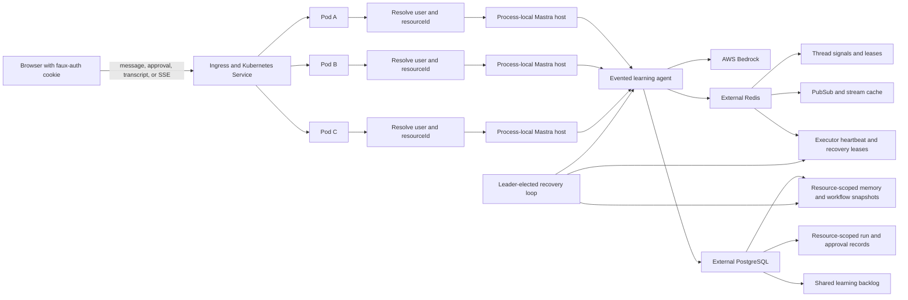
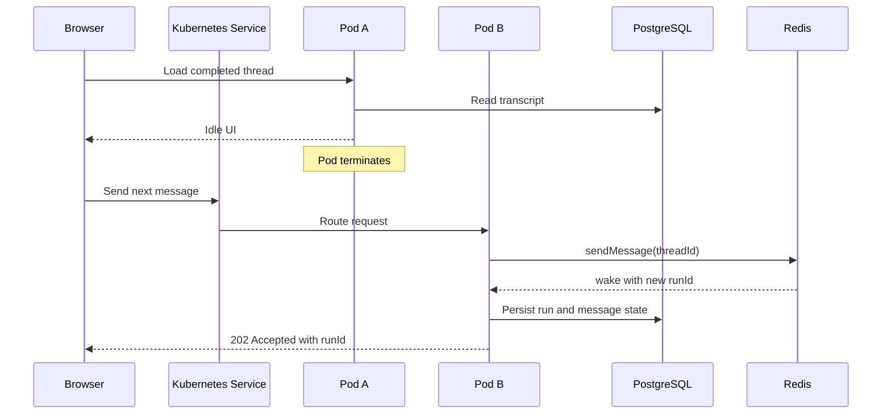
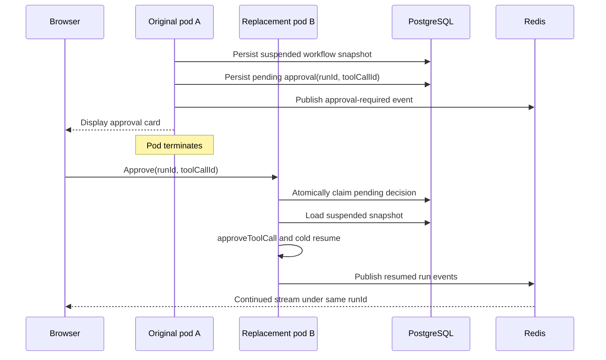
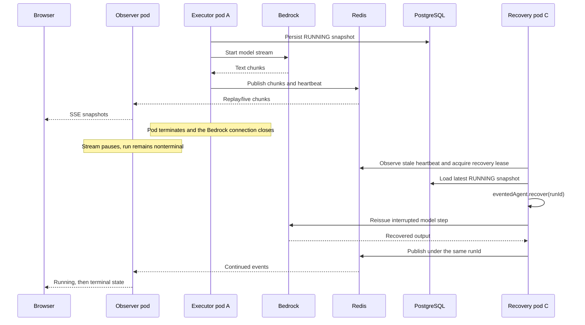
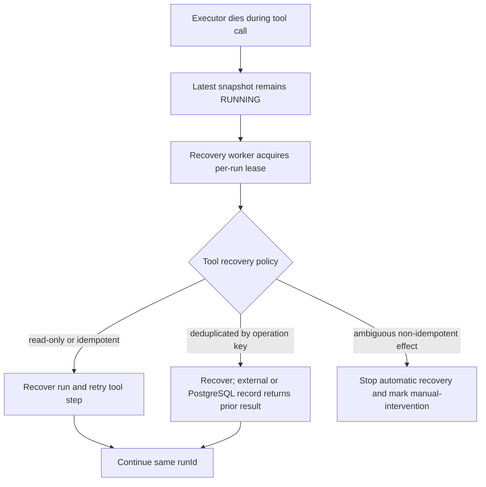

# Mastra durable agent and Kubernetes high-availability plan

Status: Planned

Created: 2026-07-20 09:25:10 America/New_York

Updated: 2026-07-22 America/New_York

## Why this plan now

The completed learning app demonstrates a real agent loop: Claude can inspect a backlog, choose among four typed tools, pause before a mutation, accept a one-time approval or decline, update state idempotently, and continue from the tool result. A development-only name prompt now derives a stable faux-user identity, and one shared AgentController caches an isolated process-local session for each user. Today, one Node.js process still owns the active agent loops, live UI projections, approval gates, local conversation database, and mutable backlog file.

Mastra 1.51.0 provides the durable-agent capabilities needed to separate those responsibilities. In particular, it adds persisted `RUNNING` snapshots, discovery and recovery APIs, cold resume of suspended runs after process replacement, and reliable message/signal wake-up for durable agents.

This plan pursues two outcomes:

1. **Durable execution through process replacement.** A run can outlive its initiating HTTP request and, after an executor crash or pod termination, another process can reconstruct it from the latest persisted snapshot and continue it under the same `runId`.
2. **Kubernetes-native high availability.** Multiple interchangeable pods behind a Deployment, Service, and load-balanced ingress can accept messages, serve user-isolated transcripts, observe runs, resolve approvals, and recover orphaned work without sticky sessions or a singleton host.

Recovery is at least once, not exactly once. Reconstructing a run may reissue an LLM request and may re-execute a tool call that began after the latest persisted checkpoint. Tool side effects must therefore be idempotent or protected by application-owned idempotency records.

The intended guarantee is:

```text
request-independent, observer-independent, service-instance-independent,
and recoverable after executor loss from the latest durable snapshot

with at-least-once LLM and tool-step execution
```

## Outcome

Adapt the learning app into a production-shaped background-agent application using Mastra 1.51.0's `createEventedAgent()` and Agent-level `eventedAgent.sendMessage()` APIs.

Every request first resolves the faux user from the HTTP-only cookie and derives the same stable `resourceId` on every pod. A message accepted by any pod is delivered to the active run for that user's thread or wakes one new run under Mastra's Redis-backed thread lease. The endpoint returns the authoritative `runId` without waiting for Bedrock or the tool loop. A browser may observe its run through any pod and receive replayed and live model, tool, and approval events over Server-Sent Events.

User-partitioned conversation memory, durable workflow snapshots, approval records, and run metadata live in PostgreSQL. The mutable learning backlog remains deliberately shared across users in PostgreSQL. Redis provides distributed PubSub, resumable stream caching, resource-and-thread signaling and leasing, executor heartbeats, and recovery leases.

If an executor pod disappears while a durable run is `RUNNING`, a coordinated recovery worker waits for the executor heartbeat to expire, acquires a per-run recovery lease, and calls `eventedAgent.recover(runId)`. If a pod disappears while a run is suspended for approval, any pod receiving the approval rehydrates the suspended snapshot and resumes it under the same `runId`.

## Relationship to earlier plans

This plan extends:

- [`2026-07-10-102257-mastra-agent-controller-nextjs-plan.md`](./2026-07-10-102257-mastra-agent-controller-nextjs-plan.md)
- [`2026-07-15-130130-basic-learning-backlog-agent-plan.md`](./2026-07-15-130130-basic-learning-backlog-agent-plan.md)
- [`2026-07-22-114821-basic-fake-auth-chat-isolation-plan.md`](./2026-07-22-114821-basic-fake-auth-chat-isolation-plan.md)

The current baseline includes four backlog tools, two approval-gated mutations, idempotent status transitions, a pending-approval UI, visible tool activity, and persisted conversation history isolated by a stable faux-user `resourceId`. The backlog itself is intentionally shared.

Those earlier plans intentionally optimized for one local Next.js process and process-local AgentController sessions. This plan replaces that runtime boundary with server-derived user resource identity plus durable thread and run identities while preserving the faux-auth UX, per-user chat isolation, learning agent, Bedrock model, shared backlog, tools, approval semantics, conversation behavior, and snapshot-oriented React UI.

## Scope

In scope:

- Pin `@mastra/core` to `1.51.0` and pin compatible Mastra storage and Redis packages exactly.
- Wrap the existing base `Agent` with `createEventedAgent()`.
- Use `eventedAgent.sendMessage()` as the single user-message ingress path.
- Use PostgreSQL for Mastra memory, workflow snapshots, run metadata, approval records, and backlog state.
- Use external Redis for distributed PubSub, persistent stream cache, thread leases, heartbeats, and recovery coordination.
- Preserve the current faux-user partition: derive `resourceId` only from the server-side cookie identity and enforce it on every thread, run, event, and approval operation.
- Observe by `runId` from any pod and reconnect without affinity.
- Cold-resume approvals from any pod.
- Recover orphaned `RUNNING` runs after executor loss.
- Define readiness, draining, failure detection, and multi-replica verification behavior.

Out of scope:

- Exactly-once LLM calls or arbitrary external side effects
- Automatic retry of tools that cannot be made idempotent
- Secure authentication, identity providers, roles, and protection against name impersonation
- Per-user learning backlogs or workspaces
- Cross-region Redis or PostgreSQL design
- Production Helm charts, managed-service provisioning, and cloud-specific ingress configuration
- Multi-cluster recovery
- Long-term storage of every raw stream chunk

## Current architecture gap

The existing application cannot become highly available by changing only its storage URL:

- `globalThis.mastraLearningUserSessions` caches one process-local AgentController `Session` promise per faux-user ID.
- Each user's `session.subscribe()` and `session.displayState` expose process-local live state.
- Each user's pending approval gate exists only in that session.
- Each user's selected thread is implicit in the cached session.
- `POST /api/chat` waits for `session.sendMessage()` to finish.
- `PATCH /api/chat` can resolve approval only through the session that owns the run.
- `.data/mastra.db` and `.data/learning-backlog.json` are local to one host.

The faux-auth cookie is already replica-friendly: every pod can normalize the same name and derive the same opaque user ID without a server session store. The distributed bridge must use that server-derived identity to compute `resourceId`, then use explicit `threadId`, `runId`, and `toolCallId` values and reconstruct the user's UI projection from shared storage plus durable-agent events.

## Target guarantees

| Scenario | Expected behavior |
| --- | --- |
| Initiating HTTP request returns | The evented run continues independently of the request. |
| Browser refreshes or disconnects | It reconnects with `runId`, catches up from Redis while the run is nonterminal, and follows live events. |
| Observer pod terminates | Native EventSource reconnection reaches another ready pod. |
| Two clients observe one run | Both receive the same logical run stream. |
| Alice presents Bob's `threadId` or `runId` | The server-derived resource ownership check rejects the request without exposing whether Bob's object exists. |
| Alice and Bob run concurrently | Their threads, memory, run state, events, and approvals remain isolated; both see the same shared backlog state. |
| Idle-thread messages arrive through different pods | Mastra's thread lease elects one wake-up run; losing senders deliver to the winner. |
| Executor pod terminates during a `RUNNING` run | A coordinated worker recovers the run from PostgreSQL under the same `runId`. |
| Executor pod terminates while approval is pending | The suspended snapshot remains; any pod can cold-resume it when the exact approval arrives. |
| Recovery repeats an LLM or tool step | The system treats this as expected at-least-once behavior; application mutations remain idempotent. |
| A completed run is reopened | The transcript and durable application state come from PostgreSQL, not retained PubSub topics. |
| A tool mutation completes | Every pod subsequently reads the same PostgreSQL state. |
| An idle replica is replaced | No recovery is necessary; the replacement joins using shared infrastructure. |

## Target architecture



Each pod contains the same faux-identity derivation, immutable agent definition, and process-local connection pools. No pod contains authoritative conversation, approval, or backlog state. The current hash-derived user ID and `fake-chat:<userId>` resource format are persisted identity schema: all replicas must run compatible normalization and derivation logic during a rollout.

### Shared-state responsibilities

| Responsibility | Backend | Durability role |
| --- | --- | --- |
| Conversation memory | PostgreSQL through Mastra storage, partitioned by `resourceId` | Reconstructs only the current user's thread history on any pod. |
| Workflow snapshots | PostgreSQL through Mastra workflow storage, carrying `resourceId` and `threadId` | Supports ownership-preserving cold resume and crash recovery. |
| Application run records | PostgreSQL application tables keyed and constrained by resource ownership | Tracks user/run ownership, status, idempotency, approvals, and recovery attempts. |
| Learning backlog | Shared PostgreSQL application tables | Provides one transaction-safe backlog view for every user and pod. |
| Agent and thread events | `RedisStreamsPubSub` | Carries resource-and-thread signaling and live cross-pod events. |
| Resumable stream cache | `RedisServerCache` or the 1.51-compatible persistent Redis cache | Replays missed nonterminal run events after observer reconnection. |
| Thread wake lease | Redis through Mastra's `LeaseProvider` | Elects one run when several pods message an idle thread. |
| Executor heartbeat | Redis application keys | Distinguishes a healthy `RUNNING` snapshot from an orphan. |
| Recovery coordination | Redis leader and per-run leases | Prevents replicas from recovering the same run concurrently. |

PostgreSQL and Redis are required dependencies in distributed mode. Startup and readiness must fail explicitly when they are unavailable; the application must never fall back silently to process-local storage or PubSub.

## Key architecture decisions

### 1. Use one Mastra host per process and no production AgentController session

Create one process-local `Mastra` instance containing:

- the shared PostgreSQL storage provider
- one `RedisStreamsPubSub`
- one persistent Redis server cache
- the base learning `Agent`
- the evented wrapper registered as a Mastra agent

Retain `globalThis` memoization only for this immutable per-process host and its connection pools during Next.js development. Do not create a global user session, store an active thread in the process, or use AgentController display state as the production source of truth.

The browser-facing projection is application code built from the persisted transcript, run record, approval record, and run-addressed durable events.

### 2. Wrap the existing agent with `createEventedAgent()`

Keep the existing instructions and all four backlog tools in the base `Agent`. Preserve explicit no-approval behavior for read tools and approval requirements for both mutation tools.

Create an `EventedAgent` with the shared Redis PubSub and persistent Redis cache, then register it on the `Mastra` instance so 1.51 recovery can resolve its model, tools, memory, processors, and request context after a restart.

Do not set `cache: false` in the production configuration. Mastra's durable-agent documentation identifies a persistent cache as the production requirement for resumable streams; the 1.51 runtime also forwards terminal topic cleanup through the cache wrapper to Redis.

Terminal run topics are cleaned shortly after completion. PostgreSQL transcript and run records are therefore the durable completed-run view. Redis replay is for active, suspended, and recently terminal observation—not historical audit.

### 3. Make faux-user resource identity a durable ownership invariant

Retain the existing server-side identity shape and resource mapping:

```ts
type UserContext = {
  userId: string;       // current FakeUser.id; replaceable by a real auth subject later
  displayName: string;  // presentation only, never an ownership key
  resourceId: string;   // `fake-chat:${userId}`
};
```

Resolve this context from the HTTP-only cookie on every browser request. Do not accept `userId`, `ownerId`, or `resourceId` from request bodies, query strings, route parameters, local storage, or Mastra event payloads supplied by the browser.

Treat `resourceId` as part of every durable ownership relation:

- A thread belongs to exactly one resource.
- A run record stores its `resourceId` and `threadId`.
- A message submission is unique within `(resourceId, clientMessageId)`.
- An approval belongs to `(resourceId, runId, toolCallId)`.
- A decision identity is deduplicated within its resource and approval.
- A tool-operation record includes the initiating resource for attribution even though the backlog is shared.
- Application Redis keys are namespaced by agent and resource before thread or run identity.

For every thread-, run-, event-, transcript-, or approval-addressed HTTP request, load the durable object and compare its resource to the server-derived `resourceId`. Return the same not-found response for missing and foreign objects so an ID cannot be used to enumerate another faux user's data.

Recovery has no browser cookie. It obtains `resourceId` from the persisted workflow snapshot and requires it to match the application run record before rehydrating memory, tools, approvals, or heartbeats. A mismatch is a corruption/security condition and enters `manual-intervention` rather than guessing ownership.

Keep faux auth explicitly non-secure: anyone can sign out and type another person's name. This plan preserves partitioning once a faux identity is selected; it does not convert the name prompt into authentication. Encapsulate the mapping behind `UserContext` so a future real identity provider can supply a stable subject without changing Mastra resource ownership throughout the application.

### 4. Use `eventedAgent.sendMessage()` as the only user-message ingress

For each submitted user message:

1. Resolve `UserContext` from the cookie and validate `threadId`, content, and a caller-generated `clientMessageId`.
2. Verify that `threadId` belongs to the derived `resourceId`.
3. Atomically create or resolve an application message-submission record in `dispatching` state by `(resourceId, clientMessageId)`.
4. Include `clientMessageId` and non-authoritative actor metadata in the Mastra message, then call `eventedAgent.sendMessage(message, { resourceId, threadId })` with the required idle stream options.
5. Await `result.accepted`, which settles when Mastra chooses `wake`, `deliver`, `blocked`, `persist`, or `discard`; it does not wait for completion.
6. For `wake` or `deliver`, atomically store and return the authoritative accepted `runId` with the same `resourceId` and `threadId`.
7. Treat `blocked`, `persist`, and `discard` as explicit API outcomes rather than inventing a run ID.

When the thread is idle, Redis-backed leasing elects one process to wake a new run. When the thread already has an active run, the message is delivered to that run. The browser normally disables a second send while an approval is pending, but the server still handles every accepted action explicitly.

For this learning app, the API also rejects ordinary follow-up submissions while its durable run record is `waiting-for-approval`, `recovery-pending`, or `recovering`. This avoids treating a recovery interval as an idle thread. A simultaneous idle-send race can still produce `wake` and `deliver`, which Mastra correlates to the same winning run.

The start endpoint does not call `eventedAgent.stream()` and does not implement a second application-owned thread-start lock.

### 5. Make thread and message identity explicit

- Store `threadId` in browser state and local storage under a server-provided opaque user partition key, or clear it completely on user switch. A thread selected by Alice must never be offered automatically after switching to Bob.
- Include `threadId` and `clientMessageId` in every message request.
- Return the authoritative `threadId` and accepted `runId`.
- Treat a missing thread ID as a request to create a thread, never as permission to select a process-local recent thread.
- Deduplicate retries using `(resourceId, clientMessageId)`. If a pod dies after Mastra accepts a message but before its run ID is recorded, reconcile the `dispatching` row against resource-scoped Mastra message metadata, thread history, and active workflow snapshots. Do not immediately redeliver an ambiguous submission.
- Continue accepting only cookie-derived identity. Explicit IDs address objects; they never authorize access to them.

### 6. Observe by run ID and persist a projection

The SSE endpoint first loads the run record and verifies its `resourceId` against the current `UserContext`, then calls `eventedAgent.observe(runId)` or the exact 1.51-compatible API. It does not subscribe to a Session object.

`RunProjection` consumes relevant `AgentChunk` events and emits complete `ChatState` snapshots. It must be idempotent with respect to transport replay and must tolerate recovery producing another attempt of the current LLM or tool step.

Persist enough application projection state to reconstruct pending approval, recovery status, terminal status, and important tool activity after Redis terminal-topic cleanup. Do not store every text delta permanently; completed assistant messages remain the canonical transcript.

Observer cancellation is connection-local. Do not call durable-agent cleanup merely because one browser disconnects, because cleanup destroys retained run events and registry state.

### 7. Cold-resume approvals from any pod

Persist the pending approval's `resourceId`, `threadId`, `runId`, `toolCallId`, tool name, arguments, status, and decision identity before presenting it to the browser.

The run's durable workflow snapshot is `suspended`, not `running`, while it waits. The crash-recovery scanner must therefore ignore it. When an approval reaches any pod:

1. Resolve `UserContext`, verify that the run and approval belong to its `resourceId`, and atomically record the exact decision as accepted but not yet delivered, protected by an approval-delivery lease.
2. Call `eventedAgent.approveToolCall()` or `declineToolCall()` with the original `runId` and exact `toolCallId`.
3. Let Mastra 1.51 rehydrate a missing in-process registry entry from the persisted suspended snapshot.
4. Install executor ownership and heartbeat for the pod driving the resumed run.
5. Mark the decision delivered and resume events under the same `runId`.
6. Let a reconciler retry accepted-but-undelivered decisions after lease expiry; first recheck whether the run is still suspended.
7. Reject conflicting, stale, mismatched, or already-delivered decisions without executing a tool again.

If the executor dies after Mastra persists suspension but before the application projection writes its approval row, a projector/reconciler rebuilds that row from the suspended snapshot and retained approval event before accepting a decision.

This design does not route approval back to the former owner pod.

### 8. Coordinate recovery instead of enabling auto-recovery on every pod

Set Mastra's automatic durable-agent recovery to off in every web replica. Mastra 1.51 warns that enabling boot-time automatic recovery on all replicas makes them race over the same `RUNNING` runs.

Run a recovery reconciliation loop under a leader lease. For each candidate from `eventedAgent.listActiveRuns()`:

1. Read the application run record, its `resourceId`, and executor heartbeat.
2. Ignore healthy runs whose owner heartbeat is current.
3. Ignore suspended or terminal runs.
4. Wait through an orphan grace period after the heartbeat expires.
5. Acquire a resource-namespaced per-run recovery lease such as `recover:<agentId>:<resourceId>:<runId>` with an owner token and expiry.
6. Recheck heartbeat, durable status, terminal state, and snapshot-to-run resource ownership after acquiring the lease.
7. Mark the run `recovering`, increment its recovery attempt, and install a new executor heartbeat.
8. Call `eventedAgent.recover(runId)` and keep the recovery lease renewed while that process drives the run.
9. Return the run to `running`, `waiting-for-approval`, or a terminal status based on emitted events.
10. On recovery-worker loss, allow another worker to retry after both heartbeat and recovery lease expiry.

`listActiveRuns()` reports persisted `RUNNING` snapshots; it does not by itself prove that their executors are dead. Executor heartbeat and the post-lock recheck are mandatory.

Use a leader lease to reduce duplicate scanning and a per-run lease for correctness across leader turnover. A Kubernetes Lease or Redis leader key is acceptable for the coarse leader election; the per-run recovery lease remains in Redis beside the run heartbeat.

### 9. Treat recovery as at least once

Recovery re-drives the workflow from its latest persisted snapshot. Consequently:

- An in-flight Bedrock request may be issued again and incur additional cost.
- Previously streamed partial text may be followed by a regenerated attempt that differs.
- A tool call may run again if its side effect occurred but the next snapshot was not committed.
- A recovery worker that crashes may cause the same step to be attempted again by its successor.

The two backlog mutation tools already use monotonic, idempotent transitions. Move them to PostgreSQL conditional transactions and add a stable tool-operation identity derived from `runId` and `toolCallId`, with the initiating `resourceId` recorded for attribution. Record the operation and result transactionally with the shared backlog transition so a repeated call returns the prior logical result.

Classify every future mutating tool as one of:

- **Idempotent:** safe to invoke repeatedly with the same operation identity.
- **Deduplicated:** external system accepts an idempotency key and returns the original result.
- **Compensatable:** duplicate execution can be detected and repaired explicitly.
- **Non-recoverable:** automatic recovery must stop for manual intervention before repeating it.

Do not claim exactly-once behavior from a Redis lease. A partitioned or paused former executor can outlive its lease, so durable side-effect idempotency remains the final safety boundary.

### 10. Maintain an explicit run state model

Persist application-facing states independently from SSE connection state:

```text
accepted
  -> running
  -> waiting-for-approval
  -> recovery-pending
  -> recovering
  -> completed | failed | cancelled | manual-intervention
```

`recovery-pending` means the owner heartbeat is stale but the grace period or recovery lease has not yet resolved. `manual-intervention` means automatic recovery is unsafe or exhausted. A temporary observer disconnect never changes run state.

### 11. Treat graceful shutdown as the fast path

On SIGTERM:

- mark the pod unready before shutdown
- stop accepting work that could wake a new run
- continue existing executions and observers during the grace period
- keep executor and recovery leases renewed while work continues
- flush event publication and close subscriptions and pools
- exit when owned work settles or the termination deadline arrives

If the deadline kills an unfinished process, ordinary crash recovery takes over. A PodDisruptionBudget and generous `terminationGracePeriodSeconds` reduce recovery frequency but do not change at-least-once semantics.

## Multi-replica failure and recovery behavior

Assume external, highly available Redis and PostgreSQL plus at least two application replicas scheduled across different Kubernetes nodes. Pod names below indicate transient executors, not durable ownership. Each run remains owned by its persisted user `resourceId` before, during, and after failover.

### Failure classification

| State at process loss | Durable state | Required reaction | User-visible result |
| --- | --- | --- | --- |
| Thread idle, waiting for the next user message | Completed transcript and idle thread in PostgreSQL | No run recovery. The next message reaches any pod and wakes a new run. | Usually none; reconnect only if the failed pod held the browser connection. |
| Suspended, waiting for tool approval | Suspended workflow snapshot plus pending approval record | No `recover()` scan. Any pod cold-resumes the exact run when approval arrives. | Approval remains actionable after pod replacement. |
| Streaming from Bedrock | `RUNNING` snapshot, emitted prefix in Redis, stale executor heartbeat | Recovery coordinator acquires the run lease and calls `recover(runId)`. | Stream pauses, then resumes; the current model step may restart and produce repeated or divergent text. |
| Executing a read-only or idempotent tool | `RUNNING` snapshot and tool operation identity | Recover and safely retry the step. | Temporary pause; repeated invocation has the same logical result. |
| Executing a non-idempotent tool | `RUNNING` snapshot but side-effect outcome may be ambiguous | Do not retry automatically; mark `manual-intervention`. | UI explains that operator review is required. |
| Serving SSE only | Run continues elsewhere; events and snapshots remain shared | Browser reconnects through the Service and re-observes the run. | Brief connection interruption, no execution interruption. |

### 1. Pod terminates while the thread is idle

Once a run has completed, no replica is the active owner of the thread. A pod may hold an HTTP keep-alive connection or an idle browser connection, but there is no agent loop to recover.



If Pod A held an SSE or HTTP connection, the browser reconnects. No recovery API is involved because there is no nonterminal run.

### 1a. Pod terminates while waiting for approval

Approval waiting is functionally distinct from idle. The run has not completed; its workflow snapshot is durably `suspended` and the application has a pending approval record.



The recovery coordinator does not call `recover()` for a suspended run. Mastra's approval resume path performs the required rehydration when the user acts.

### 2. Pod terminates while streaming from Bedrock

The TCP connection to Bedrock and the in-memory model iterator die with the pod. The last PostgreSQL workflow snapshot remains `RUNNING`, and Redis retains events already published for the nonterminal run.



The application must not concatenate semantic output blindly if recovery restarts the current generation. `RunProjection` should retain event identity and recovery-attempt metadata so the UI can indicate that execution resumed. The final persisted assistant message is authoritative after completion.

### 3. Pod terminates while performing a tool call

The recovery mechanics are the same as for an interrupted model request, but the side-effect risk is higher:



For backlog mutations, use `(runId, toolCallId)` as the stable operation identity. In one PostgreSQL transaction:

1. Insert or lock the tool-operation record.
2. If it already completed, return its stored result.
3. Otherwise apply the conditional backlog transition.
4. Store the result and mark the operation complete.
5. Commit both together.

This covers both failure windows: termination before commit leaves nothing committed and recovery performs the operation; termination after commit but before the next workflow snapshot causes recovery to return the committed result without applying the transition again.

### 4. Other likely scenarios

| Failure | Expected response |
| --- | --- |
| Start pod dies after Mastra accepts the message but before recording or returning the run ID | Client retries with the same `clientMessageId`; the application reconciles the `dispatching` record from Mastra metadata and snapshots. If still ambiguous, it reports pending reconciliation instead of redelivering. |
| Observer pod dies while another pod executes | EventSource reconnects to another pod and observes the same run. No recovery occurs. |
| Approval pod dies after recording the decision but before resume | Another pod acquires the approval-delivery lease, verifies that the workflow remains suspended, and retries cold resume. |
| Executor dies after suspension but before the application approval row is written | A projector/reconciler rebuilds the pending approval from the suspended snapshot and retained approval event. |
| Recovery pod dies during recovery | Its heartbeat and recovery lease expire; the next coordinator may recover again from the latest snapshot. LLM/tool work may repeat. |
| Two recovery coordinators overlap during leader turnover | The per-run recovery lease and post-acquisition heartbeat recheck allow only one to call `recover()`. |
| Graceful rollout terminates an executor | Readiness drains first; the pod finishes if it can. If the grace deadline kills it, normal recovery follows. |
| Node failure removes executor and observer together | The browser reconnects to another node while the coordinator recovers the run from external PostgreSQL and Redis. |
| Redis temporarily fails | Stop new message wakes and recovery decisions; mark pods unready. Preserve PostgreSQL state and reconcile after Redis returns. Do not fall back to local PubSub or locks. |
| PostgreSQL temporarily fails | Stop new starts, approvals, and recovery because snapshots and idempotency cannot be trusted. Mark pods unready and reconcile after restoration. |
| Redis or network partition lets an old executor outlive its lease | A duplicate executor is possible. Stable tool-operation identities prevent duplicate application mutations; alert on competing heartbeats and trace attempts. |
| Run completes just before its pod dies | Reconcile PostgreSQL terminal state before attempting recovery. If a stale `RUNNING` snapshot remains, recover to finish persistence; if terminal state is committed, do not restart. |
| Terminal Redis topic has been cleaned | Rebuild the UI from PostgreSQL transcript, run status, approval history, and persisted tool projection. |
| A browser signs out or switches faux users while its former run continues | Close that browser's old observer and clear its local projection. The old resource-owned run continues or recovers independently; the newly selected user cannot observe or control it. |
| One pod executes runs for several faux users and terminates | Reconcile each orphaned run independently by its snapshot and run-record `resourceId`; never recreate a process-local user Session map. |

## Proposed HTTP contract

Every endpoint resolves `UserContext` from the faux-auth cookie. Request payloads never contain an authoritative user or resource ID. Object-addressed endpoints return the same not-found response when the object is absent or belongs to another resource.

### Existing `/api/session`

Keep the current `GET`, `POST`, and `DELETE` faux-session behavior. The server-rendered page or `GET` response may expose an opaque, stable `userKey` for browser-state namespacing alongside the display name. That key is a UI partition hint only; possession of it never authorizes a chat operation because the HTTP-only cookie remains the sole source for server-side `UserContext`.

### `POST /api/chat/threads`

Create a conversation owned by the current user's derived `resourceId` in shared storage.

```ts
{ threadId: string }
```

### `GET /api/chat/threads/:threadId`

Verify thread ownership, then return the durable transcript and current run projection. Include the nonterminal `runId`, if one exists, so the browser can attach.

### `POST /api/chat/runs`

Request:

```ts
{
  threadId: string;
  clientMessageId: string;
  message: string;
}
```

Successful wake or delivery:

```text
202 Accepted
```

```ts
{
  threadId: string;
  clientMessageId: string;
  runId: string;
  action: "wake" | "deliver";
  status: "accepted";
}
```

A retry with the same `(resourceId, clientMessageId)` returns the same logical result once known. A still-ambiguous dispatch returns an explicit pending-reconciliation response rather than sending the message again. A suspended-thread `blocked` outcome returns a conflict without creating another run.

### `POST /api/chat/runs/:runId/approval`

Request:

```ts
{
  toolCallId: string;
  decisionId: string;
  decision: "approve" | "decline";
}
```

Verify that the run and approval belong to the current resource, then atomically accept only the exact pending tool call and decision identity. The route may execute on any pod and invokes the durable cold-resume path without waiting for the remainder of the run. An accepted-but-undelivered decision remains recoverable by an approval reconciler.

Duplicate retries with the same `decisionId` return the original outcome and may finish an incomplete delivery. Conflicting, stale, or mismatched decisions return `409 Conflict` and do not execute the tool.

### `GET /api/chat/runs/:runId/events`

Open an SSE stream that:

- verifies resource and thread ownership
- replays retained nonterminal events and follows live events
- emits complete `ChatState` snapshots
- distinguishes running, waiting, recovery-pending, and recovering states
- sends heartbeat comments for proxy idle timeouts
- terminates after a durable terminal state
- unsubscribes non-destructively when the browser disconnects
- falls back to PostgreSQL projection if the terminal Redis topic has already been cleaned

### `GET /api/chat/runs/:runId`

Verify resource ownership, then return the persisted run record and current projection without opening SSE. Use this during reconnect, terminal-topic cleanup, and failure-injection tests.

## Browser behavior

1. Resolve the current faux-user display and opaque partition key from the server-rendered user context; never use either as server authorization input.
2. Load or create the active `threadId` from storage namespaced to that user, or begin without one after a user switch.
3. Fetch the resource-checked persisted transcript and current run projection.
4. Generate a stable `clientMessageId` before submitting a message.
5. Submit once and retry ambiguous network failures with the same ID while the same user remains selected.
6. On `wake` or `deliver`, store the returned `runId` in that user's browser partition and observe it.
7. Replace React state with complete projection snapshots.
8. Preserve `runId` across refresh until a durable terminal state is observed.
9. Render recovery-pending and recovering separately from connection loss.
10. Preserve the existing tool activity and approval card.
11. Generate a stable `decisionId` and submit approval by exact `runId` and `toolCallId`.
12. On user switch, close the old SSE connection and clear in-memory thread, run, message, tool, approval, and retry state before mounting the new identity.
13. After terminal-topic cleanup, reload the canonical transcript and persisted projection.

Connection state and execution state remain independent. The browser can be reconnecting while the agent continues, and the browser can be connected while the agent waits for recovery.

## Local development infrastructure

Add a development Compose configuration with:

- Redis for Streams, persistent run-event cache, thread leases, heartbeats, and recovery leases
- PostgreSQL for Mastra memory, workflow snapshots, run metadata, approval records, tool-operation records, and backlog state

Document:

```text
REDIS_URL=redis://localhost:6379
DATABASE_URL=postgresql://...
MASTRA_RUNTIME_MODE=distributed
POD_INSTANCE_ID=local-a
```

Keep AWS credentials outside containers and continue using the standard Bedrock credential chain. Support running two or three local Next.js processes against the same Compose dependencies for failure testing.

Retain the faux-auth cookie as a stateless development identity token. All local processes must derive the same user and `resourceId` from it. Document clearly that the cookie is not signed proof of identity and that typing another user's name intentionally bypasses any privacy expectation.

## Kubernetes deployment contract

- Run at least two replicas with topology spread or pod anti-affinity across nodes.
- Route HTTP and SSE through a Service and ingress without session affinity.
- Deploy compatible faux-identity normalization, cookie version, hash derivation, and resource-prefix logic to every replica; changing that identity schema requires an explicit data migration and rollout strategy.
- Derive user context independently on every request; do not add a process-local or sticky HTTP login session.
- Mark a pod ready only after PostgreSQL, Redis, PubSub, cache, and required subscriptions initialize.
- Remove readiness while shared dependencies are unavailable or the pod is draining.
- Use liveness only for a wedged process, not ordinary dependency outages that could create restart storms.
- Stop new wake-ups before graceful termination and allow active runs to settle during `terminationGracePeriodSeconds`.
- Disable ingress response buffering for SSE, permit long-lived responses, and preserve EventSource reconnection.
- Use a PodDisruptionBudget for voluntary disruptions and topology spread for node failures.
- Run the recovery loop under leader election and retain per-run recovery leases.
- Alert on stale runs, repeated recovery attempts, competing executor heartbeats, manual-intervention state, and dependency unavailability.

A production Helm chart, autoscaling policy, and managed Redis/PostgreSQL configuration remain separate delivery work.

## Ordered implementation plan

### Phase 0: Verify Mastra 1.51 contracts

1. Upgrade and pin `@mastra/core` to `1.51.0`; pin compatible Redis and PostgreSQL packages.
2. Create a focused `EventedAgent` smoke fixture registered on a Mastra instance with PostgreSQL storage, Redis Streams PubSub, and persistent Redis cache.
3. Call `eventedAgent.sendMessage()` on an idle thread and verify `accepted` returns `action: "wake"` and an authoritative `runId`.
4. Race simultaneous sends from separate processes and verify one `wake`, one `deliver`, and one shared run ID.
5. Observe that run from a separate process and verify replay plus live chunks.
6. Suspend for approval, terminate the executor, and approve from a fresh process under the same `runId` and `toolCallId`.
7. Terminate an executor during a slow model or tool step, then call `recover(runId)` from a fresh process and verify continuation under the same run ID.
8. Verify `listActiveRuns()` includes healthy `RUNNING` work and therefore requires application heartbeat filtering.
9. Verify terminal topic cleanup and document exactly which transcript and projection data remain in PostgreSQL.
10. Verify observer disconnect does not invoke destructive cleanup.
11. Repeat send, observe, approval, and recovery with two resource IDs and verify no thread, event, message, approval, or memory crosses resources while the backlog remains shared.

Checkpoint: the selected APIs and storage behavior are proven across separate Node processes before application restructuring.

### Phase 1: Externalize state and runtime infrastructure

1. Add validated distributed-mode environment configuration.
2. Add local Redis and PostgreSQL Compose services and health checks.
3. Build one process-local Mastra host using shared storage, PubSub, and cache.
4. Register the base learning agent and its evented wrapper; do not register a production AgentController.
5. Move the backlog to PostgreSQL with one-time seed initialization and conditional transitions.
6. Add resource-owned run, approval, message-submission, and tool-operation application tables with ownership constraints and indexes.
7. Retain `globalThis` only for the process-local host promise and connection pools.

Checkpoint: two processes read each user's resource-scoped threads, read the same shared backlog, and subscribe to the same Redis-backed events without crossing user boundaries.

### Phase 2: Make conversations request-addressable

1. Remove the process-local per-user Session map from `MastraRuntime` while retaining the current faux-user resolver.
2. Add one server-side `UserContext` mapper from `FakeUser.id` to `fake-chat:<userId>` and use it at every API boundary.
3. Add resource-checked shared-storage thread create and transcript endpoints.
4. Move active `threadId` into browser-managed state partitioned by the selected faux user.
5. Add stable `clientMessageId` generation, resource-scoped application deduplication, and ambiguous-dispatch reconciliation.
6. Preserve “New conversation” without process-local thread selection.
7. Clear all in-memory chat/run state on user switch and update persistence smoke tests to use two explicit identities.

Checkpoint: any process can derive the same user resource from the faux-auth cookie, then load and continue only that resource's conversations using shared identifiers.

### Phase 3: Start and observe evented runs

1. Implement `POST /api/chat/runs` with cookie-derived `UserContext`, thread ownership verification, and `eventedAgent.sendMessage()`.
2. Map accepted actions explicitly and return `202` with authoritative `runId` for `wake` or `deliver`.
3. Persist run and message-submission records idempotently and reconcile ambiguous dispatches.
4. Add executor ownership and heartbeat updates when the local process receives `wake`.
5. Implement `RunProjection` for model, tool, approval, recovery, and terminal events.
6. Add resource-checked run-addressed SSE and run-status endpoints.
7. Update React to observe by `runId`, reconnect, and fall back to PostgreSQL terminal state.

Checkpoint: process A accepts and executes while processes B and C can observe and reconnect.

### Phase 4: Distribute approval handling

1. Persist resource-owned pending approval metadata before exposing it to the browser.
2. Implement the resource-checked run-addressed approval endpoint with stable `decisionId`, a delivery lease, and accepted-versus-delivered state.
3. Invoke 1.51 cold resume from any pod.
4. Reconcile accepted-but-undelivered decisions and reject conflicting, stale, and mismatched decisions.
5. Preserve tool approval policies and decline context.
6. Verify a fresh process can resume after the original executor is gone.

Checkpoint: start, observe, approve, and resumed execution can occur on different pods.

### Phase 5: Add coordinated crash recovery

1. Keep Mastra automatic durable-agent recovery disabled in web replicas.
2. Add executor heartbeat and expiry semantics with conservative thresholds.
3. Add leader election for the recovery scanner.
4. Add tokened, renewable per-run recovery leases.
5. Filter `listActiveRuns()` using durable run state and stale owner heartbeat, and require snapshot `resourceId` to match the run record.
6. Call `recover(runId)` only after the orphan grace period, lease acquisition, and state recheck.
7. Emit and persist recovery-pending, recovering, success, failure, and attempt metadata.
8. Classify tool recovery safety and stop unsafe runs for manual intervention.
9. Allow recovery takeover after a recovery worker itself dies.

Checkpoint: killing an executor during model streaming or an idempotent tool call causes another pod to continue the same run.

### Phase 6: Harden side effects and shutdown

1. Implement `(runId, toolCallId)` operation records for both backlog mutations and persist the initiating `resourceId` for attribution.
2. Commit each operation result with its conditional backlog transition.
3. Add graceful readiness draining and active-run tracking.
4. Add bounded application projection and run-record retention.
5. Confirm terminal Redis cleanup does not remove canonical transcript or audit state.
6. Add alerts and structured logs for recovery and split-brain indicators.

Checkpoint: every injected failure either completes safely, recovers at least once, or reaches an explicit manual-intervention state.

### Phase 7: Document and verify Kubernetes behavior

1. Update the README architecture, per-user isolation model, shared-backlog boundary, and durability matrix.
2. Document PostgreSQL, Redis, cache, PubSub, snapshot, heartbeat, and lease responsibilities.
3. Add multi-process start/observe/approve/recover walkthroughs.
4. Document readiness, liveness, draining, SSE ingress, topology spread, and PodDisruptionBudget requirements.
5. Run static checks, smoke tests, browser tests, and the complete failure-injection matrix.

Checkpoint: another developer can reproduce failover and explain both the guarantees and at-least-once boundary.

## Verification plan

### Static and upgrade verification

- `npm test`
- `npm run typecheck`
- `npm run lint`
- `npm run build`
- Confirm exact Mastra package versions and peer dependencies.
- Confirm no production route imports or resolves a global AgentController Session.
- Confirm user messages enter only through `eventedAgent.sendMessage()`.
- Confirm no thread-, run-, event-, transcript-, or approval-addressed route trusts a client-supplied user or resource ID.
- Confirm all ownership checks use the cookie-derived `UserContext` and all application records retain `resourceId`.

### Cross-process happy path

1. Start processes A, B, and C against shared Redis and PostgreSQL.
2. Sign in as Alice and submit a tool-using message through A.
3. Observe Alice's live output through B using the returned `runId`.
4. Submit Alice's approval through C.
5. Verify the run finishes under the same `runId` and all processes read Alice's transcript and the shared backlog.
6. Sign in as Bob, verify Alice's transcript and operational state are absent, and verify Bob sees the shared backlog mutation.

### Message and recovery concurrency

- Race idle-thread sends and verify one `wake`, one `deliver`, and one authoritative run ID.
- Kill the accepting pod after acceptance but before its run ID is recorded; retry with the same `clientMessageId` and verify reconciliation does not blindly redeliver.
- Run overlapping recovery scanners and verify only one obtains the per-run lease.
- Pause a healthy executor long enough to approach the heartbeat threshold and verify the grace period prevents premature recovery.
- Kill a recovery worker and verify another can continue after lease expiry.

### Reconnect and event cleanup

- Disconnect the browser while execution continues; reconnect through another pod and receive missed plus live events.
- Kill the observer pod without affecting execution.
- Attach two observers and verify consistent logical output.
- Verify observer disconnect does not destroy shared history.
- After terminal cleanup, verify the complete UI is reconstructable from PostgreSQL.
- Switch from Alice to Bob while Alice has a nonterminal run through another client; verify Alice's run continues but Bob receives none of its state or events.
- Switch back to Alice and verify the correct resource-scoped run or transcript is restored.

### Cross-user isolation

- Attempt Alice's `threadId` through every Bob-authenticated thread and message endpoint; return the same response as an unknown thread.
- Attempt Alice's `runId` through Bob's status and SSE endpoints; emit no run metadata or events.
- Attempt Alice's `runId` and `toolCallId` through Bob's approval endpoint; do not record a decision or resume the run.
- Use the same `clientMessageId` for Alice and Bob and verify independent resource-scoped submission records.
- Run Alice and Bob concurrently on the same and different pods and verify thread leases are scoped by resource and thread.
- Recover Alice's orphaned run without a browser request and verify snapshot, run record, memory, and approval resource IDs agree before execution resumes.
- Verify both users intentionally read and mutate one shared backlog while tool-operation audit records retain the initiating resource.

### Approval recovery

1. Reach a mutation approval in process A.
2. Verify the suspended snapshot and pending approval record are durable.
3. Kill A.
4. Submit approval through B.
5. Verify cold resume, exactly one accepted decision, and the original `runId`.
6. Kill B after accepting the decision but before marking it delivered; verify another process completes delivery after lease expiry.
7. Retry the decision and verify no second mutation.
8. Repeat with decline and verify no backlog change.

### Model-stream crash recovery

1. Start a deliberately slow Bedrock stream in A and observe through B.
2. Kill A after output has been published.
3. Verify stale heartbeat produces recovery-pending rather than terminal failure.
4. Verify C acquires the recovery lease and calls `recover(runId)`.
5. Verify observation continues under the same run ID and terminal state persists.
6. Record whether the current model step repeats output and ensure the UI represents the recovery attempt coherently.

### Tool-call crash recovery

- Kill before the backlog transaction commits; recovery applies it once.
- Kill after commit but before the next workflow snapshot; recovery returns the stored operation result without changing the backlog again.
- Verify read tools may execute repeatedly without side effects.
- Introduce a test-only non-idempotent tool and verify recovery stops at manual intervention instead of retrying it.

### Kubernetes availability behavior

- Run at least two replicas on different nodes behind one endpoint with no affinity.
- Send the same faux-auth cookie to different replicas and verify every replica derives the same `resourceId`.
- Remove an idle pod and verify the next message succeeds through another replica.
- Remove an observer pod and verify EventSource reconnection.
- Remove an executor during model streaming and verify recovery.
- Remove an executor while approval is pending and verify cross-pod cold resume.
- Remove an executor during an idempotent tool call and verify deduplicated recovery.
- Begin a graceful rollout and verify draining precedes termination.
- Verify Redis or PostgreSQL loss removes readiness without causing a liveness restart storm.

### Existing behavior

- Bedrock authentication still uses the standard AWS credential chain.
- Faux-auth name normalization and stable user derivation still pass their unit tests.
- Alice, Bob, and unauthenticated requests retain the current chat-isolation behavior.
- Multi-turn context survives process changes.
- All four learning-backlog tools execute and display their activity.
- Read tools remain automatic.
- Mutations retain exact-call approval, idempotency, and completed-item protection.
- “New conversation” creates a distinct persisted thread.
- The learning backlog remains shared across faux users.
- Client errors contain no credentials, connection strings, or internal stack traces.

## Risks and mitigations

- **Premature recovery of a healthy run:** require a stale executor heartbeat, orphan grace period, per-run lease, and post-lock recheck; never recover from `listActiveRuns()` alone.
- **Duplicate LLM cost or divergent regenerated text:** expose recovery attempts, expect at-least-once model calls, and make the final persisted message authoritative.
- **Duplicate tool side effects:** require stable operation identities and transactional or provider-supported deduplication before automatic recovery.
- **Split brain after a pause or partition:** use conservative lease timing, detect competing heartbeats, and rely on side-effect idempotency rather than lease-based exactly-once claims.
- **Duplicate user delivery after an ambiguous HTTP failure:** persist `dispatching` before sending, include `clientMessageId` in Mastra metadata, reconcile before retrying, and expose unresolved ambiguity instead of promising a cross-system atomic commit.
- **Duplicate approval delivery:** atomically claim one `decisionId` for one pending `toolCallId`, use a delivery lease, and reconcile accepted-but-undelivered decisions.
- **Run-addressed APIs bypass user isolation:** derive `UserContext` only from the cookie, persist `resourceId` on every object, and use indistinguishable not-found responses for absent and foreign IDs.
- **Browser state leaks across user switching:** namespace local state by an opaque server-provided user partition and clear every in-memory thread/run projection before mounting the next user.
- **Identity derivation changes split one user's data:** treat faux-name normalization, cookie version, hashing, and the `fake-chat:` prefix as persisted schema requiring migration and version-compatible rollout.
- **Recovery resumes under the wrong resource:** require workflow snapshot, run record, thread, and approval resource IDs to agree before model or tool execution.
- **Faux auth is mistaken for security:** retain explicit trusted-environment warnings; name knowledge still permits impersonation even though resource partitioning is correctly enforced.
- **Terminal event cleanup removes UI history:** persist canonical transcript, terminal state, approval history, and important tool projection in PostgreSQL.
- **Observer cleanup destroys a suspended or active run:** keep SSE unsubscribe connection-local and reserve durable-agent cleanup for terminal lifecycle management.
- **Dependency outage creates local divergence:** fail readiness and stop starts, approvals, and recovery; never fall back to local infrastructure.
- **Long Bedrock or tool latency resembles executor loss:** renew an independent heartbeat timer and choose thresholds above normal event gaps.
- **Rolling deployment recovers too often:** drain before SIGTERM and provide a generous grace period.
- **Recovery API changes while beta:** pin all Mastra packages exactly and retain focused cross-process contract tests.

## Deferred work

- Exactly-once external side effects where the destination offers no idempotency facility
- Automated compensation workflows for ambiguous external mutations
- Production-ready Kubernetes manifests, Helm charts, autoscaling, and cloud provisioning
- Production Redis/PostgreSQL HA, backups, disaster recovery, and secret management
- Real authentication, signed identity, identity providers, roles, and authorization policy
- Per-user learning backlogs and workspaces
- Historical raw-event browser and long-term event archive
- Multi-region execution and recovery
- Long-term observability dashboards and SLOs

## References

- [Mastra 1.51.0 release](https://github.com/mastra-ai/mastra/releases/tag/%40mastra%2Fcore%401.51.0)
- [Mastra durable-agent crash recovery](https://github.com/mastra-ai/mastra/pull/19191)
- [Mastra durable-agent cold resume](https://github.com/mastra-ai/mastra/pull/19363)
- [Mastra durable-agent message wake and run registration](https://github.com/mastra-ai/mastra/pull/19046)
- [Mastra durable agents](https://mastra.ai/docs/long-running-agents/durable-agents)
- [Mastra agent signals](https://mastra.ai/docs/long-running-agents/signals)
- [Mastra DurableAgent reference](https://mastra.ai/reference/agents/durable-agent)
- [Mastra PubSub](https://mastra.ai/docs/server/pubsub)
- [Mastra RedisStreamsPubSub](https://mastra.ai/reference/pubsub/redis-streams)
- [Mastra LeaseProvider](https://mastra.ai/reference/pubsub/lease-provider)
- [Kubernetes Services and networking](https://kubernetes.io/docs/concepts/services-networking/)
- [Kubernetes disruptions](https://kubernetes.io/docs/concepts/workloads/pods/disruptions/)
