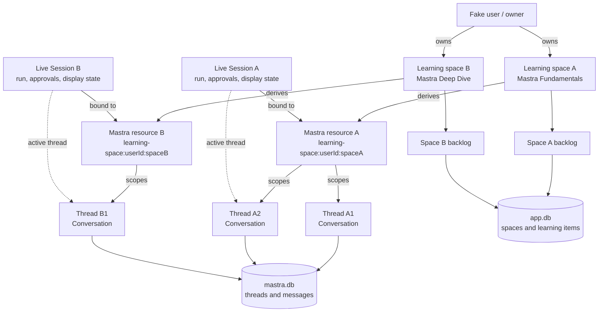
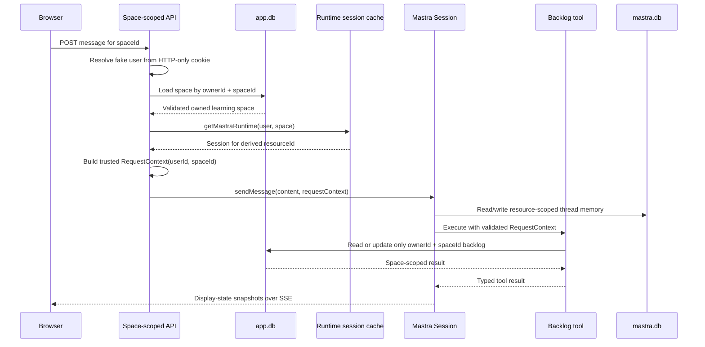

# Learning spaces, conversation navigation, and isolated SQL backlogs

## Intended outcome

Add private learning spaces that make the Mastra ownership and runtime hierarchy visible in the product:

```text
Fake user
  → owns learning spaces
    → each space maps to one Mastra resource
      → each resource contains conversation threads
        → one live Session controls the active thread
```

Each space starts as an independent copy of the current Mastra curriculum. Mastra threads and memory are isolated through `resourceId`; backlog tools receive trusted user and space identity through `RequestContext` and access space-scoped data in a separate `.data/app.db`.

The existing shared backlog JSON and existing `fake-chat:<userId>` conversations remain untouched legacy data. Users start fresh in the new learning-space model.

## Delivery phases

This document is the umbrella architecture and combined acceptance record. The
implementation is divided into four independently reviewable child plans:

1. [Phase 1: application database foundation](./2026-07-23-161759-learning-spaces-phase-1-app-database-plan.md)
   — completed 2026-07-23 —
   adds migrations, learning-space persistence, the ownership-scoped repository,
   and temporary-database tests without changing running application behavior.
2. [Phase 2: default-space isolation](./2026-07-23-161800-learning-spaces-phase-2-default-space-isolation-plan.md)
   — completed 2026-07-23 —
   proves the full trust and isolation path for one automatically provisioned
   space: SQL backlog, trusted request context, space-specific Mastra Session,
   space-scoped routes, SSE, and approvals.
3. [Phase 3: multiple-space experience](./2026-07-23-161801-learning-spaces-phase-3-multiple-spaces-plan.md)
   — completed 2026-07-23 —
   exposes space creation, URL-driven selection, the space controls, SSE
   remounting, busy-state locks, and separate-tab behavior.
4. [Phase 4: conversation navigation and hardening](./2026-07-23-161802-learning-spaces-phase-4-conversation-navigation-plan.md)
   — completed 2026-07-23 —
   adds thread summaries and switching, completes the sidebar, and closes the
   combined documentation and acceptance matrix.

Each child plan owns its implementation order, tests, documentation changes,
and exit criteria. Do not defer all smoke coverage or documentation until phase
4; each phase must remain usable and verifiable before the next begins.

## Intended relationships

The persistent ownership hierarchy and the live runtime state are related but not interchangeable:



The selected space is resolved and authorized before Mastra or a backlog tool receives it:



## Architecture and implementation decisions

### Application database and isolation

- Add a direct `@libsql/client` dependency and create an application-owned LibSQL database at `.data/app.db`; leave Mastra internals in `.data/mastra.db`.
- Initialize versioned, idempotent application migrations once per process.
- Add `app_learning_spaces` with a UUID, owner ID, display and normalized names, and timestamps. Space names are unique case-insensitively within one owner.
- Add `app_learning_items` with the space ID, existing learning-item fields, JSON prerequisites, status, and a composite `(space_id, item_id)` key.
- Normalize space names with the same Unicode and control-character rules as fake usernames, allowing 1–60 visible characters.
- Atomically create a learning space and copy the Zod-validated tracked seed into it.
- Replace JSON backlog reads and writes with repository operations that always require both `ownerId` and `spaceId`.
- Use conditional SQL status updates so repeated or concurrent calls remain idempotent and completed items cannot regress.
- Auto-create a seeded space named **Mastra Fundamentals** when an authenticated user has no spaces.
- Keep `data/learning-backlog.seed.json` as the curriculum template; stop reading or writing `.data/learning-backlog.json`.

Application-facing types:

```ts
interface LearningSpace {
  id: string;
  name: string;
  createdAt: string;
  updatedAt: string;
}

interface LearningRequestContext {
  userId: string;
  spaceId: string;
}

interface ThreadSummary {
  id: string;
  preview: string;
  createdAt: string;
  updatedAt: string;
  isActive: boolean;
}
```

### Mastra runtime and tools

- Change runtime lookup to accept an authenticated user and validated learning space, and cache Sessions by `(userId, spaceId)`.
- Derive stable identifiers as follows:

```text
ownerId   = fake-user:<userId>
resourceId = learning-space:<userId>:<spaceId>
sessionId = learning-session:<userId>:<spaceId>
```

- Keep one shared `AgentController`; every learning space receives an independent Session, active thread, run state, approval state, and display state.
- Define a Zod-validated `LearningRequestContext` and construct it server-side for every `session.sendMessage()` call and approval continuation.
- Add the same `requestContextSchema` to every backlog tool. Tool arguments continue to contain only learning-item inputs; the model never chooses an owner or space.
- In each tool, read `userId` and `spaceId` from `context.requestContext` and call ownership-scoped repository methods.
- Verify both space ownership and item membership before every read or mutation.
- Preserve the current Session permission policies: read tools are allowed and edit tools require approval.

### API and user interface

- Add the following authenticated APIs:

```text
GET  /api/spaces
POST /api/spaces                         { name }

GET  /api/spaces/:spaceId/threads
POST /api/spaces/:spaceId/threads
PUT  /api/spaces/:spaceId/threads/:threadId/active

GET   /api/spaces/:spaceId/chat          # SSE snapshots
POST  /api/spaces/:spaceId/chat          # send message
PATCH /api/spaces/:spaceId/chat          # tool approval
```

- Replace the current unscoped chat endpoints; thread creation moves from `DELETE /api/chat` to the thread collection endpoint.
- Authenticate first, then load the requested space by `(spaceId, ownerId)` before resolving a Mastra Session. Return `404` for missing or foreign spaces without revealing ownership.
- Represent the selected resource as `/?space=<spaceId>`. A missing or invalid selection redirects to the user's first/default space, allowing different tabs to open different resources.
- Add a sidebar with a learning-space selector, inline **New space** form, conversation list, and **New conversation** action.
- Sort conversations by most recently updated and label each with its first user-message preview, falling back to **New conversation** when empty.
- Remount the chat SSE connection when the selected space changes. Refetch thread summaries after creation, switching, or a completed message.
- Disable space/thread navigation and creation in the current tab while its Session is running or awaiting approval. Server-side thread switching also returns `409` while that Session is busy.
- Support create and switch in v1; defer rename and delete actions.

## Phased implementation order

### Phase 1: application database foundation

Add the application LibSQL client, migration runner, space and item schema,
atomic seeded-space creation, ownership-scoped repository, and
temporary-database tests. Leave the current JSON-backed runtime behavior
unchanged until this foundation passes independently.

Checkpoint: repository and migration criteria pass without changing the browser
or Mastra runtime.

### Phase 2: default-space isolation

Auto-provision **Mastra Fundamentals**, move tools to the SQL repository,
introduce trusted request context, cache Sessions by user and space, add the
space-scoped chat and thread-creation routes, and move the existing browser onto
the URL-selected default space.

Checkpoint: the existing single-space user experience works end to end through
the new SQL, authorization, Session, SSE, and approval boundaries.

### Phase 3: multiple-space experience

Add space creation and selection, the inline space controls, URL navigation,
space-specific SSE lifecycle, busy-state navigation locks, and separate-tab
acceptance. Continue to expose only the active/latest conversation plus new
conversation.

Checkpoint: users can create and independently use multiple spaces without any
cross-space backlog, transcript, run, or approval state.

### Phase 4: conversation navigation and hardening

Add thread summaries, previews, sorting, active-thread switching, the completed
sidebar, authoritative busy-state conflicts, consolidated smoke coverage, final
documentation, and the complete acceptance matrix.

Checkpoint: the complete user → space → resource → thread hierarchy is visible
and safely navigable in the browser.

## Verification criteria

These are the combined release criteria for the umbrella feature. Each child
plan owns and must pass the subset introduced by that phase.

### Repository and migration tests

- Application schema initialization and repeated migrations are safe.
- Space creation and seed copying are atomic.
- Space names are unique case-insensitively per user.
- Two spaces owned by one user have independent item status.
- Two users with identically named spaces have independent item status.
- Repeated start/complete transitions are idempotent and completed items cannot regress.

### Mastra and request-context tests

- Two spaces belonging to the same user derive different resources and Sessions while retaining the same owner.
- Equivalent fake usernames resolve the same owned spaces.
- Backlog tools fail context validation when trusted user or space identity is missing.
- Read and approved-write tools affect only the selected space.
- An approval from one space cannot operate on another space's Session.
- Restarting the process recreates each space's Session against the same persisted resource and thread collection.

### API and browser acceptance

- A first sign-in creates and redirects to **Mastra Fundamentals**.
- A second space receives an independent seeded backlog and empty thread history.
- Conversation creation and switching remain within the selected resource.
- Foreign space and thread IDs return `404`.
- Space and thread controls lock during runs and pending approvals.
- Two tabs can use different learning spaces independently.
- Refresh restores the URL-selected space and its active resource.
- Unit tests, typecheck, lint, production build, tool/approval smokes, and persistence smokes pass.

## Explicitly deferred

- Real authentication and protection against fake-name impersonation.
- Shared spaces, memberships, invitations, and collaborative threads.
- Arbitrary learning-item creation, editing, deletion, and curriculum template selection.
- Space and thread rename/delete operations.
- Migration or deletion of `.data/learning-backlog.json`.
- Migration or deletion of existing `fake-chat:<userId>` Mastra resources and conversations.
- Concurrent active-thread navigation within one Session; navigation remains locked while that Session is busy.
- Production database operations, multi-process coordination, and durable execution beyond the current local architecture.

## Umbrella completion record

The learning-spaces umbrella feature completed on 2026-07-23 at 18:28:36
America/New_York.

All four child phases are implemented. The final application exposes the full
fake-user → learning-space → Mastra resource/Session → conversation-thread
hierarchy, keeps space backlogs in application-owned SQL, keeps Mastra
conversation data in separate storage, enforces trusted ownership at every
route and tool boundary, and supports isolated multi-space and multi-thread
browser navigation.

The combined gate passed 30 automated tests, typecheck, lint, production build,
direct Bedrock, controller, read-tool, approval/idempotency, fresh-process
multi-thread persistence, focused API/browser isolation checks, and
`git diff --check`. The legacy JSON backlog remained untouched.
